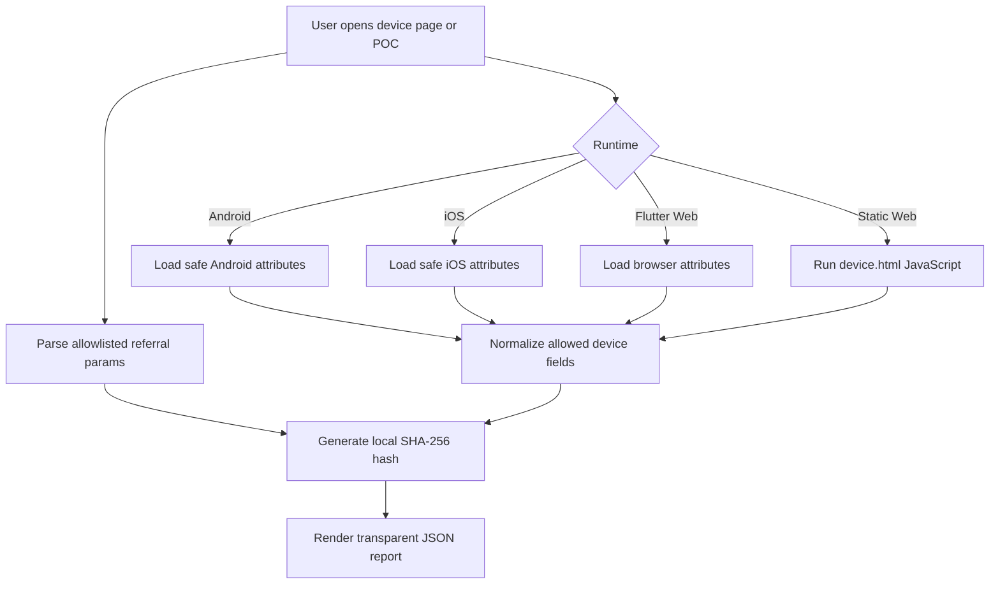

# shipflutter-skills

Flutter testing skills for AI coding agents.

## npm package

Run the package CLI:

```bash
npx shipflutter-skills list
```

The npm package ships the skill files and a small listing command. Use the open `skills` CLI below to install skills into AI agents.

Publish with an npm token:

```bash
NODE_AUTH_TOKEN='<npm-token>' npm run publish:npm
```

The token must have publish permission. If your npm account uses 2FA, use a granular token with bypass 2FA enabled or publish manually with `--otp`.

## Install skills

List available skills:

```bash
npx skills add shipflutter/skills --list
```

Install all skills for Claude Code in the current project:

```bash
npx skills add shipflutter/skills --skill '*' -a claude-code --copy
```

Install all skills globally for Claude Code:

```bash
npx skills add shipflutter/skills --skill '*' -a claude-code -g --copy
```

Install one skill:

```bash
npx skills add shipflutter/skills --skill add-feat -a claude-code --copy
npx skills add shipflutter/skills --skill add-srs -a claude-code --copy
npx skills add shipflutter/skills --skill flutter-integration-test -a claude-code --copy
npx skills add shipflutter/skills --skill flutter-driver-screenshot-test -a claude-code --copy
npx skills add shipflutter/skills --skill flutter-unit-test-coverage -a claude-code --copy
npx skills add shipflutter/skills --skill privacy-safe-device-referral-attributes -a claude-code --copy
```

## Available Skills

| Skill | Description | Example prompt |
|---|---|---|
| [`add-feat`](skills/add-feat/SKILL.md) | Creates feature user-story and technical-design docs, including `gen-tdd` source scanning. | `Run add-feat gen-tdd auth EP01 and create the feature docs.` |
| [`add-srs`](skills/add-srs/SKILL.md) | Generates or updates SRS packages from user-story and technical-design docs. | `Generate the SRS from the current user-story and technical-design docs.` |
| [`flutter-integration-test`](skills/flutter-integration-test/SKILL.md) | Adds Flutter `integration_test` coverage that runs on emulator/simulator without saving screenshot images. | `Add Flutter integration tests for the main app flow without saving screenshots.` |
| [`flutter-driver-screenshot-test`](skills/flutter-driver-screenshot-test/SKILL.md) | Adds Flutter driver screenshot tests that save PNG files through the host driver process. | `Add e2e screenshot tests for the main screens and save PNG files to screenshots/.` |
| [`flutter-unit-test-coverage`](skills/flutter-unit-test-coverage/SKILL.md) | Adds Flutter unit/widget coverage reporting with `flutter test --coverage` and optional HTML reports. | `Add a run_test.sh script that generates Flutter unit test coverage and an HTML report.` |
| [`privacy-safe-device-referral-attributes`](skills/privacy-safe-device-referral-attributes/SKILL.md) | Adds privacy-safe Flutter Android, iOS, Web, and static Web device/referral attribute demos. | `Add a transparent device referral attributes screen without third-party IP lookup or invasive fingerprinting.` |

## Repository structure

```text
skills/
├── add-feat/
│   ├── SKILL.md
│   ├── assets/templates/
│   ├── references/
│   └── scripts/add_feat.sh
├── add-srs/
│   └── SKILL.md
├── flutter-integration-test/
│   ├── SKILL.md
│   └── scripts/
│       └── integration_test.sh
├── flutter-driver-screenshot-test/
│   ├── SKILL.md
│   └── scripts/
│       └── e2e.sh
├── flutter-unit-test-coverage/
│   ├── SKILL.md
│   └── scripts/
│       └── run_test.sh
└── privacy-safe-device-referral-attributes/
    ├── SKILL.md
    ├── examples/
    │   └── prompts.md
    └── reference/
        └── attribute-contract.md
```

## Feature docs workflow

Use `add-feat gen-tdd` to derive user-story and technical-design docs from a Flutter feature source tree:

```bash
scripts/add_feat.sh gen-tdd auth EP01
```

The command creates:

- `resources/user-story/ep01-auth.md`
- `resources/technial-design/ep01-auth.md`

Use `add-srs` after that to compile the generated docs into `resources/srs.md` and render `srs-index.html` through `resources/srs.sh` using the standard two-column Mermaid SRS template.

## Device referral fingerprint POC

The repository includes `examples/flutter-poc-fingerprint` as a runnable reference for privacy-safe device/referral attributes.



Implemented attributes include platform, OS/browser version, model/manufacturer where available, locale, timezone, screen size, device pixel ratio, referrer, and allowlisted referral params. Public IP is documented as unavailable without a same-origin backend endpoint.

## Auth POC

The repository includes `examples/flutter-poc-auth` as a runnable reference for the `add-feat` and `add-srs` workflows.

It demonstrates:

- Sign-in and sign-up UI states.
- Local auth service boundary.
- User-story and technical-design docs under `resources/`.
- Unit and integration tests.

```bash
cd examples/flutter-poc-auth
../../scripts/add_feat.sh gen-tdd auth EP01
./resources/srs.sh
flutter pub get
flutter test
```

## Notes

- The install source is `shipflutter/skills` because the GitHub repository is `https://github.com/shipflutter/skills`.
- The package display name is `shipflutter-skills`.
- Skills follow the Agent Skills `SKILL.md` format with `name` and `description` frontmatter.
