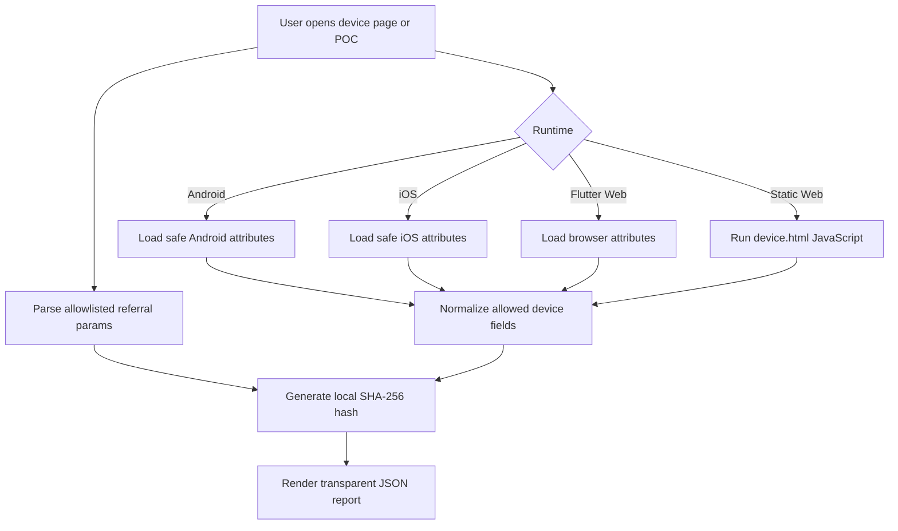

# shipflutter-skills

Flutter testing skills for AI coding agents.

Show case E2E and SRS report:
- https://shipflutter.github.io/vibe/e2e.html
- https://shipflutter.github.io/vibe/srs.html

## npm package

Run the package CLI:

```bash
npx shipflutter-skills list
```

The npm package ships the skill files and a small listing command. Use the open `skills` CLI below to install skills into AI agents.

Publish with an npm token:

```bash
NODE_AUTH_TOKEN='<npm-token>' npm run publish:npm
```

The token must have publish permission. If your npm account uses 2FA, use a granular token with bypass 2FA enabled or publish manually with `--otp`.

## Use with Claude Code

These skills follow the Agent Skills `SKILL.md` format and work with Claude Code natively. There are three ways to make Claude Code use them.

### Option A — Install as a Claude Code plugin (recommended)

The repo ships a plugin marketplace (`.claude-plugin/marketplace.json`). In Claude Code:

```text
/plugin marketplace add shipflutter/skills
/plugin install shipflutter-skills@shipflutter
```

This loads all skills (`add-feat`, `add-srs`, `appdist`, `flutter-integration-test`, `flutter-driver-screenshot-test`, `flutter-unit-test-coverage`, `privacy-safe-device-referral-attributes`) into every Claude Code session. Each skill bundles its own `scripts/`, `assets/`, and `references/`, resolved relative to the skill — no extra setup needed.

### Option B — Copy skills into a project (via the `skills` CLI)

See [Install skills](#install-skills) below to copy individual skills (or all) into `.claude/skills/` for Claude Code, Cursor, and other agents.

### Option C — Work on the skills inside this repo

To let Claude Code load the skills while developing in this repo, symlink them into the project skill path (`.claude/skills`, which is gitignored):

```bash
npm run link:claude
# or: bash scripts/link-claude-skills.sh
```

This creates `.claude/skills -> ../skills` so Claude Code discovers every skill from the source of truth without copying.

## Install skills

List available skills:

```bash
npx skills add shipflutter/skills --list
```

Install all skills for Claude Code in the current project:

```bash
npx skills add shipflutter/skills --skill '*' -a claude-code --copy
```

Install all skills globally for Claude Code:

```bash
npx skills add shipflutter/skills --skill '*' -a claude-code -g --copy
```

Install one skill:

```bash
npx skills add shipflutter/skills --skill add-feat -a claude-code --copy
npx skills add shipflutter/skills --skill add-srs -a claude-code --copy
npx skills add shipflutter/skills --skill flutter-integration-test -a claude-code --copy
npx skills add shipflutter/skills --skill flutter-driver-screenshot-test -a claude-code --copy
npx skills add shipflutter/skills --skill appdist -a claude-code --copy
npx skills add shipflutter/skills --skill flutter-unit-test-coverage -a claude-code --copy
npx skills add shipflutter/skills --skill privacy-safe-device-referral-attributes -a claude-code --copy
```

## Available Skills

| Skill | Description | Example prompt |
|---|---|---|
| [`add-feat`](skills/add-feat/SKILL.md) | Creates feature user-story and technical-design docs, including `gen-tdd` source scanning. | `Run add-feat gen-tdd auth EP01 and create the feature docs.` |
| [`add-srs`](skills/add-srs/SKILL.md) | Generates or updates SRS packages from user-story and technical-design docs. | `Generate the SRS from the current user-story and technical-design docs.` |
| [`appdist`](skills/appdist/SKILL.md) | Automated CI/CD deploy pipeline — iOS TestFlight, Android Firebase App Distribution, and Google Play Store internal testing with Telegram notifications. | `Use $appdist to set up deploy pipeline for iOS and Android.` |
| [`flutter-integration-test`](skills/flutter-integration-test/SKILL.md) | Adds Flutter `integration_test` coverage that runs on emulator/simulator without saving screenshot images. | `Add Flutter integration tests for the main app flow without saving screenshots.` |
| [`flutter-driver-screenshot-test`](skills/flutter-driver-screenshot-test/SKILL.md) | Adds Flutter driver screenshot tests that save PNG files through the host driver process. | `Add e2e screenshot tests for the main screens and save PNG files to screenshots/.` |
| [`flutter-unit-test-coverage`](skills/flutter-unit-test-coverage/SKILL.md) | Adds Flutter unit/widget coverage reporting with `flutter test --coverage` and optional HTML reports. | `Add a run_test.sh script that generates Flutter unit test coverage and an HTML report.` |
| [`privacy-safe-device-referral-attributes`](skills/privacy-safe-device-referral-attributes/SKILL.md) | Adds privacy-safe Flutter Android, iOS, Web, and static Web device/referral attribute demos. | `Add a transparent device referral attributes screen without third-party IP lookup or invasive fingerprinting.` |

## Repository structure

```text
.claude-plugin/            # Claude Code plugin marketplace manifest
├── marketplace.json
└── plugin.json
skills/
├── add-feat/
│   ├── SKILL.md
│   ├── assets/templates/
│   ├── references/
│   └── scripts/add_feat.sh
├── add-srs/
│   └── SKILL.md
├── appdist/
│   ├── SKILL.md
│   ├── agents/openai.yaml
│   ├── scripts/
│   │   ├── deploy.sh
│   │   ├── prod.sh
│   │   ├── prepare.sh
│   │   ├── telegram.sh
│   │   └── upload-playstore.py
│   ├── assets/
│   │   ├── .env.example
│   │   ├── app_dist_template/
│   │   │   └── README.md
│   │   └── github_workflows/
│   │       └── deploy-uat.yml
│   └── references/
│       ├── EP01.US001.md
│       └── ep01-shipflutter-deploy.md
├── flutter-integration-test/
│   ├── SKILL.md
│   └── scripts/
│       └── integration_test.sh
├── flutter-driver-screenshot-test/
│   ├── SKILL.md
│   └── scripts/
│       └── e2e.sh
├── flutter-unit-test-coverage/
│   ├── SKILL.md
│   └── scripts/
│       └── run_test.sh
└── privacy-safe-device-referral-attributes/
    ├── SKILL.md
    ├── examples/
    │   └── prompts.md
    └── reference/
        └── attribute-contract.md
```

## Feature docs workflow

Use `add-feat gen-tdd` to derive user-story and technical-design docs from a Flutter feature source tree:

```bash
scripts/add_feat.sh gen-tdd auth EP01
```

The command creates:

- `resources/user-story/ep01-auth.md`
- `resources/technial-design/ep01-auth.md`

Use `add-srs` after that to compile the generated docs into `resources/srs.md` and render `srs-index.html` through `resources/srs.sh`.

### SRS report views — Docs · Flow · Board

The generated `srs-index.html` ships a left-sidebar switcher with three views, all built from the same `resources/` sources:

- **📄 Docs** — the full SRS: purpose, scope, user stories, requirements, use cases, entities, traceability, and every screen's ASCII layout, with a sticky table of contents.
- **🔀 Flow** — a canvas that renders each screen's real ASCII mockup and connects them with the navigation events from each screen's `## Events`. Screens auto-order into a path so a hub screen (e.g. sign-in) sits between the screens it links to.
- **🗂️ Board** — a sprint kanban with **Backlog / To Do / In Progress / In Review / Done** columns. Each user story becomes a card placed by its `Status:` line; clicking a card opens its full description and acceptance-criteria task checklist. A **List** layout adds status filter tags to slice the stories.

Two conventions wire these up (emitted by `add-feat gen-tdd`):

- Screen `## Events` written as `EventName -> description` (or `→`) referencing the target screen draw the **Flow** arrows.
- A `Status:` line under each `## EPXX.US###` story places it on the **Board**.

Live demo: <https://shipflutter.github.io/vibe/srs.html>

## Sample prompt — generate the full product docs

Paste this prompt into Claude Code (with the `add-feat` and `add-srs` skills installed) to make the agent analyze a codebase and produce the **complete document set** — feature brief, user stories, technical design, screen layouts, and a rendered SRS with the **Docs · Flow · Board** views — using the latest templates.

> Use the **add-feat** and **add-srs** skills to analyze this project and create the full product documentation.
>
> **1. Analyze first.** Map the product end to end (frontend, backend/API, data model, build/deploy). Group the functionality into epics `EP01, EP02, …`, each with a kebab-case slug (e.g. `ep01-auth`). List the epics before writing files.
>
> **2. For every epic, create — under `resources/` and following the latest templates in `skills/add-feat/assets/templates/`:**
> - `resources/user-story/epXX-<slug>.md` — stories as `## EPXX.US###: Title`, each with a `Status:` line (`Backlog | To Do | Sprint | In Progress | In Review | Done`), an `As a … I want … so that …` line, and an `Acceptance criteria:` bullet list (nested bullets = sub-tasks).
> - `resources/technial-design/epXX-<slug>.md` — Technologies, Entry Points (real file paths), Flow (numbered), a **Mermaid** flow diagram, an Entities table, and Tests.
> - `resources/screens/epXX-<slug>-screen.md` — first heading = screen name; one fenced ASCII wireframe (box-drawing `┌─┐│└┘├┤┬┴`); `## Components`, `## States`, `## Events`. Write events as `EventName -> description` (or `→`) and reference the target screen **by file id** (e.g. `… -> navigate to ep02-…-screen`) or **by title keyword** so the **Flow** view draws the arrows; add a return event on the target for two-way connectors.
> - A single `resources/feature-brief.md` — product brief + the epic catalog table.
>
> **3. Compile the SRS.** Write `resources/srs.md` (purpose, scope, requirements summary, user-story index, use cases, a `## Screens / UI Surfaces` section — leave it for the script to inject — data/entity model with a Mermaid ER diagram, external interfaces/API, NFRs, risks, and a traceability matrix linking FR → epic → stories → design → screen → verification).
>
> **4. Render.** Ensure `resources/srs.sh` exists (copy the latest from `examples/flutter-poc-auth/resources/srs.sh` and rebrand the sidebar title), then run `./resources/srs.sh` to generate `srs-index.html` at the project root and verify all three views work: **📄 Docs** (TOC + injected screens), **🔀 Flow** (one card per screen, arrows from `## Events`), **🗂️ Board** (one card per story, placed by `Status:`).
>
> Keep box-drawing characters intact inside fenced code blocks, keep everything local (no external renderers), and keep `resources/srs.md` as the single editable source of truth.

> Tip: to derive starter docs from an existing Flutter feature tree, run `scripts/add_feat.sh gen-tdd <slug> EPXX` first, then refine the generated files.

### Deliverables checklist

The agent's output is complete when every box is ticked:

**Per-epic docs (latest templates)**
- [ ] `resources/feature-brief.md` — product brief + epic catalog table.
- [ ] `resources/user-story/epXX-<slug>.md` for each epic.
  - [ ] Stories use `## EPXX.US###: Title`.
  - [ ] Each story has a `Status:` line (Board column) — omit only to default to **Done**.
  - [ ] Each story has an `As a …` line (card description) + `Acceptance criteria:` bullets (task checklist); nested bullets = sub-tasks.
- [ ] `resources/technial-design/epXX-<slug>.md` for each epic.
  - [ ] Technologies · Entry Points (real paths) · Flow · **Mermaid** diagram · Entities table · Tests.
- [ ] `resources/screens/epXX-<slug>-screen.md` for each UI-bearing epic.
  - [ ] First heading = screen name; ASCII wireframe in a fenced code block.
  - [ ] `## Components`, `## States`, `## Events`.
  - [ ] `## Events` use `EventName -> description` referencing the target screen by file id or title keyword (drives **Flow** arrows); return event added for two-way arrows.

**SRS package**
- [ ] `resources/srs.md` — purpose, scope, requirements summary, user-story index, use cases, **`## Screens / UI Surfaces`** placeholder section, data/entity model (Mermaid **ER**), API/interfaces, NFRs, risks, **traceability matrix**.
- [ ] `resources/srs.sh` present (latest version) and rebranded sidebar title.
- [ ] `srs-index.html` regenerated at project root by running `./resources/srs.sh`.

**Verification (open `srs-index.html`)**
- [ ] **📄 Docs** — sidebar TOC works; each `resources/screens/*.md` is injected under *Screens / UI Surfaces*.
- [ ] **🔀 Flow** — one card per screen with its real ASCII mockup; navigation arrows appear where `## Events` reference other screens.
- [ ] **🗂️ Board** — one card per user story, placed in the right column by `Status:`; Board/List toggle + status filters work; clicking a card shows description + acceptance-criteria tasks.
- [ ] Box-drawing characters preserved; no leftover injection markers; everything renders locally.

## Device referral fingerprint POC

The repository includes `examples/flutter-poc-fingerprint` as a runnable reference for privacy-safe device/referral attributes.


```mermaid
flowchart TD
  A[User opens device page or POC] --> B{Runtime}
  B -->|Android| C[Load safe Android attributes]
  B -->|iOS| D[Load safe iOS attributes]
  B -->|Flutter Web| E[Load browser attributes]
  B -->|Static Web| F[Run device.html JavaScript]
  C --> G[Normalize allowed device fields]
  D --> G
  E --> G
  F --> G
  A --> H[Parse allowlisted referral params]
  H --> I[Generate local SHA-256 hash]
  G --> I
  I --> J[Render transparent JSON report]
```

Implemented attributes include platform, OS/browser version, model/manufacturer where available, locale, timezone, screen size, device pixel ratio, referrer, and allowlisted referral params. Public IP is documented as unavailable without a same-origin backend endpoint.

## Auth POC

The repository includes `examples/flutter-poc-auth` as a runnable reference for the `add-feat` and `add-srs` workflows.

It demonstrates:

- Sign-in and sign-up UI states.
- Local auth service boundary.
- User-story and technical-design docs under `resources/`.
- Unit and integration tests.

```bash
cd examples/flutter-poc-auth
../../scripts/add_feat.sh gen-tdd auth EP01
./resources/srs.sh
flutter pub get
flutter test
```

## Notes

- The install source is `shipflutter/skills` because the GitHub repository is `https://github.com/shipflutter/skills`.
- The package display name is `shipflutter-skills`.
- Skills follow the Agent Skills `SKILL.md` format with `name` and `description` frontmatter.
- Claude Code discovers skills from `.claude/skills/` (project) and `~/.claude/skills/` (global), or from an installed plugin. The repo's `.claude-plugin/` manifest exposes all skills as the `shipflutter-skills` plugin.
