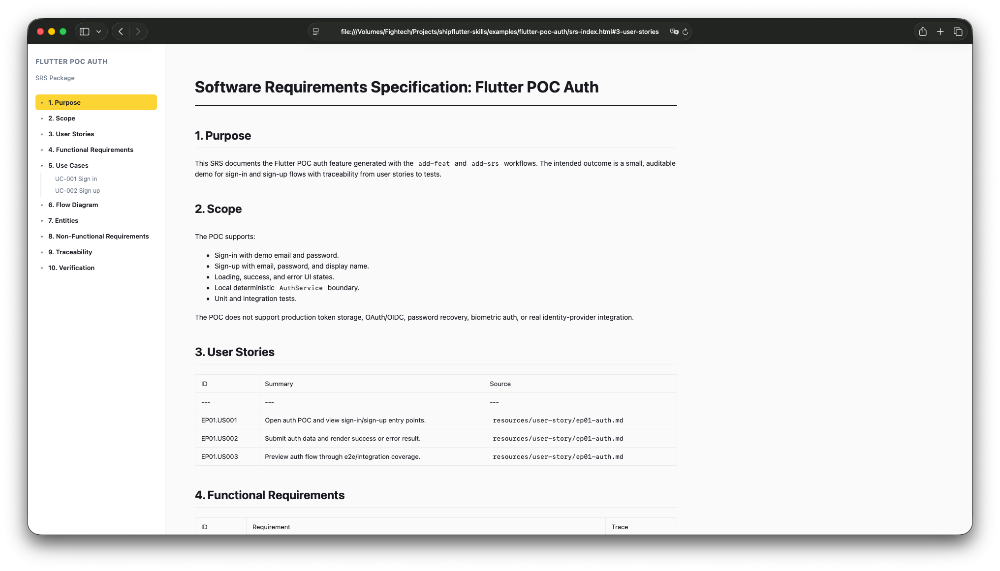
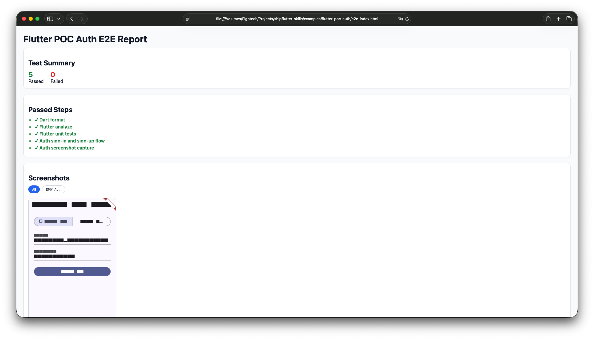
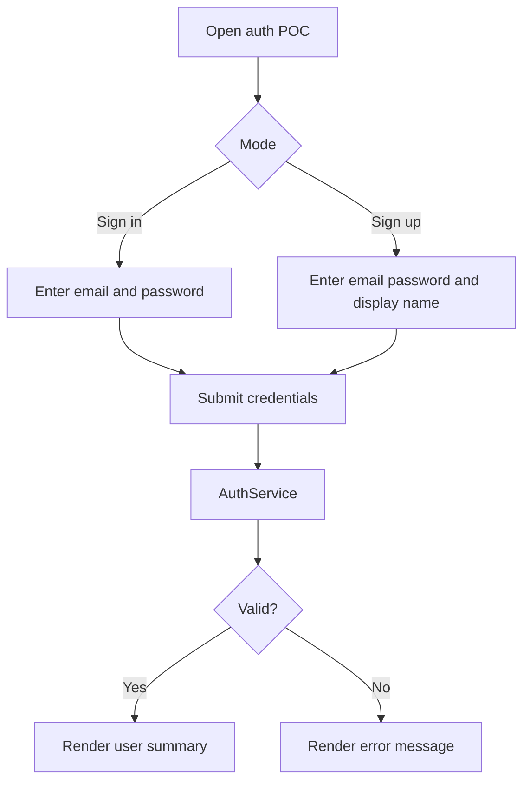

# Flutter POC Auth

Sign-in and sign-up demo for the `add-feat` and `add-srs` workflows.

This POC keeps auth local and deterministic. It demonstrates UI states, form fields, service boundaries, tests, and generated user-story/TDD documentation without connecting to a production identity provider.

## Features

- Sign in with demo credentials.
- Sign up with email, password, and display name.
- Loading, success, and error states.
- Local `AuthService` boundary that can be replaced with an API service.
- Unit, widget, integration, and screenshot test coverage.
- `e2e.sh` generates screenshot PNG files, builds `e2e-index.html`, and opens the report automatically.
- User-story and technical-design docs generated through `add_feat.sh gen-tdd auth EP01`.

## Demo screenshots

| Feature | Screenshot |
| --- | --- |
| Sign-in flow |  |
| Sign-up flow |  |

## Demo credentials

```text
email: demo@shipflutter.dev
password: password123
```

## Flow



## Run

```bash
flutter pub get
flutter run -d chrome
```

## Validate

```bash
dart format --set-exit-if-changed .
flutter analyze
flutter test
```

Run e2e:

```bash
./e2e.sh
```

The script runs the auth flow headlessly, captures screenshots with `test/auth_screenshot_test.dart`, generates `e2e-index.html`, and opens the report automatically.

## Generate docs with add-feat
Example
- https://shipflutter.github.io/vibe/srs.html#sec-7-5

From this example directory:

```bash
../../scripts/add_feat.sh gen-tdd auth EP01
```

Generated files:

- `resources/user-story/ep01-auth.md`
- `resources/technial-design/ep01-auth.md`

## Generate SRS HTML with add-srs

`resources/srs.md` is the editable SRS source. Render it to `srs-index.html` with:

```bash
./resources/srs.sh
```

Generated file:

- `srs-index.html`
