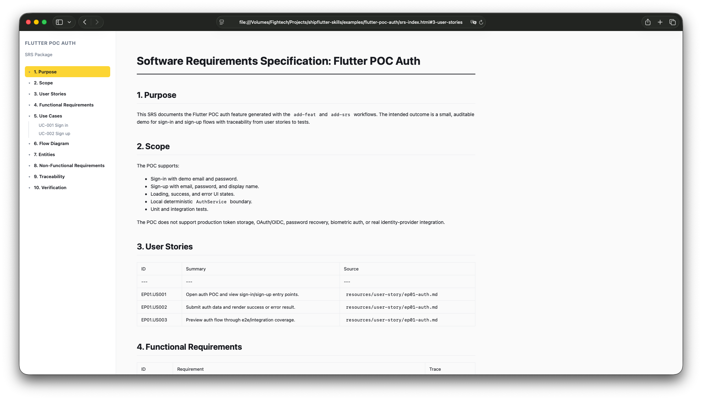
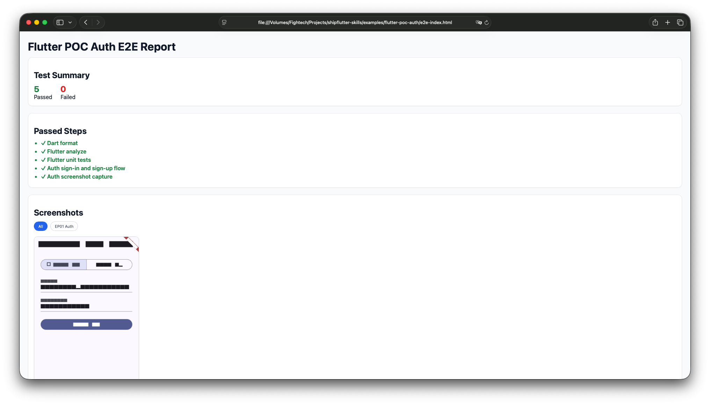
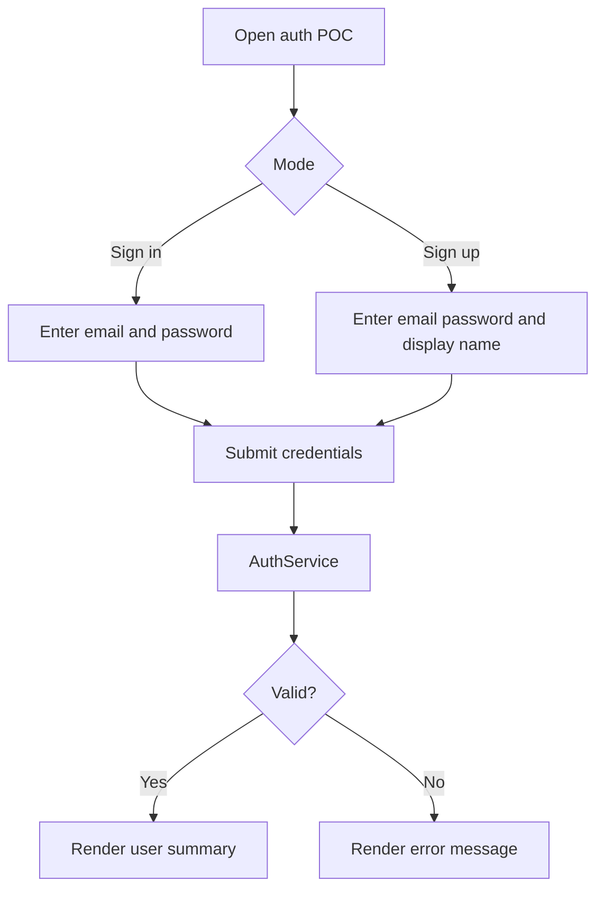

# Flutter POC Auth

Sign-in and sign-up demo for the `add-feat` and `add-srs` workflows.

This POC keeps auth local and deterministic. It demonstrates UI states, form fields, service boundaries, tests, and generated user-story/TDD documentation without connecting to a production identity provider.

## Features

- Sign in with demo credentials.
- Sign up with email, password, and display name.
- Loading, success, and error states.
- Local `AuthService` boundary that can be replaced with an API service.
- Unit, widget, integration, and screenshot test coverage.
- `e2e.sh` generates screenshot PNG files, builds `e2e-index.html`, and opens the report automatically.
- User-story and technical-design docs generated through `add_feat.sh gen-tdd auth EP01`.
- `srs-index.html` SRS report with three interactive views — **Docs**, **Flow** (screen-navigation canvas), and **Board** (sprint kanban) — generated by `resources/srs.sh`.

## Demo screenshots
Example
- https://shipflutter.github.io/vibe/srs.html#sec-7-5
----

| Feature | Screenshot |
| --- | --- |
| Sign-in flow |  |
| Sign-up flow |  |

## Demo credentials

```text
email: demo@shipflutter.dev
password: password123
```

## Flow


```mermaid
flowchart TD
  A[Open auth POC] --> B{Mode}
  B -->|Sign in| C[Enter email and password]
  B -->|Sign up| D[Enter email password and display name]
  C --> E[Submit credentials]
  D --> E
  E --> F[AuthService]
  F --> G{Valid?}
  G -->|Yes| H[Render user summary]
  G -->|No| I[Render error message]
```

## Run

```bash
flutter pub get
flutter run -d chrome
```

## Validate

```bash
dart format --set-exit-if-changed .
flutter analyze
flutter test
```

Run e2e:

```bash
./e2e.sh
```

The script runs the auth flow headlessly, captures screenshots with `test/auth_screenshot_test.dart`, generates `e2e-index.html`, and opens the report automatically.

## Generate docs with add-feat

From this example directory:

```bash
../../scripts/add_feat.sh gen-tdd auth EP01
```

Generated files:

- `resources/user-story/ep01-auth.md`
- `resources/technial-design/ep01-auth.md`

## Generate SRS HTML with add-srs

`resources/srs.md` is the editable SRS source. Render it to `srs-index.html` with:

```bash
./resources/srs.sh
```

Generated file:

- `srs-index.html`

### Three interactive views (Docs · Flow · Board)

The generated `srs-index.html` has a left-sidebar switcher. Live demo: <https://shipflutter.github.io/vibe/srs.html>

| View | What it shows |
| --- | --- |
| **📄 Docs** | The full SRS — user stories, requirements, use cases, entities, traceability, and every screen's ASCII layout — with a sticky table of contents. |
| **🔀 Flow** | A canvas of the real screen mockups connected by navigation arrows. Arrows are inferred from each screen's `## Events`; screens auto-order so the sign-in screen sits as the hub between forgot-password and sign-up. |
| **🗂️ Board** | A sprint kanban — **Backlog / To Do / In Progress / In Review / Done**. Each user story is a card placed by its `Status:` line; click a card for its full description and acceptance-criteria tasks. The **List** layout adds status filter tags. |

These views are data-driven:

- **Flow arrows** come from screen `## Events` (`EventName -> navigate to <target-screen-file-id>`).
- **Board columns** come from the optional `Status:` line on each `## EPXX.US###` story (`Backlog | To Do | In Progress | In Review | Done`, default `Done`).
