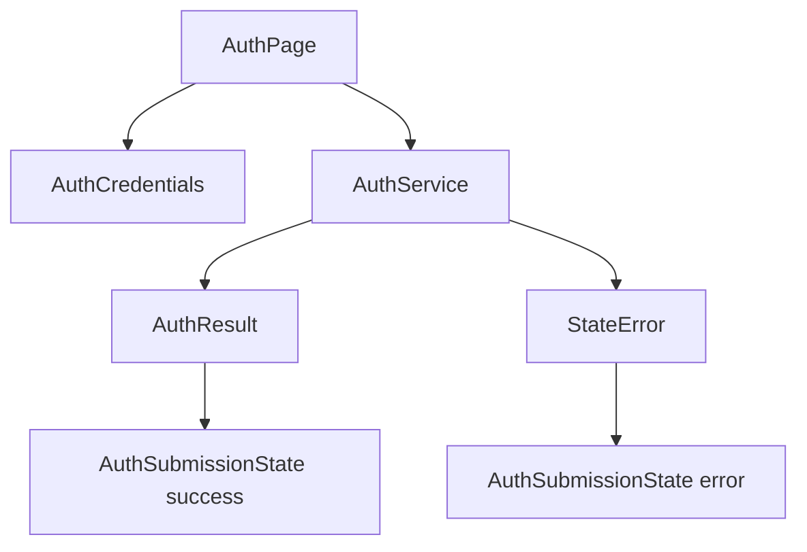

# Technical Integration: Flutter POC Auth

This document describes the sign-in/sign-up POC that demonstrates the `add-feat` and `add-srs` documentation standard.

## Scope

This POC supports:

- Sign-in form with email and password.
- Sign-up form with email, password, and display name.
- Local deterministic `AuthService` for demo validation.
- Success and error states rendered in the UI.
- Unit and integration tests.

This POC does not support:

- Real password storage.
- Token issuance.
- OAuth/OIDC/SAML.
- Production session management.
- Network calls to a real identity provider.

## Architecture



## Source map

| Area | File | Purpose |
| --- | --- | --- |
| App entry | `lib/main.dart` | Builds `AuthPocApp`. |
| UI | `lib/src/auth_page.dart` | Renders sign-in/sign-up forms and state. |
| Models | `lib/src/auth_models.dart` | Defines mode, credentials, result, and submission state. |
| Service | `lib/src/auth_service.dart` | Demo auth boundary for sign-in/sign-up. |
| Unit tests | `test/auth_service_test.dart` | Verifies valid sign-in and sign-up. |
| Integration tests | `integration_test/auth_flow_test.dart` | Verifies UI flows. |

## User-story traceability

| User story | Coverage |
| --- | --- |
| `EP01.US001` Open auth POC | `integration_test/auth_flow_test.dart` |
| `EP01.US002` Submit auth data | `test/auth_service_test.dart`, `integration_test/auth_flow_test.dart` |
| `EP01.US003` Preview auth flow | `e2e.sh` |

## Verification

```bash
dart format --set-exit-if-changed .
flutter analyze
flutter test
./e2e.sh
```
