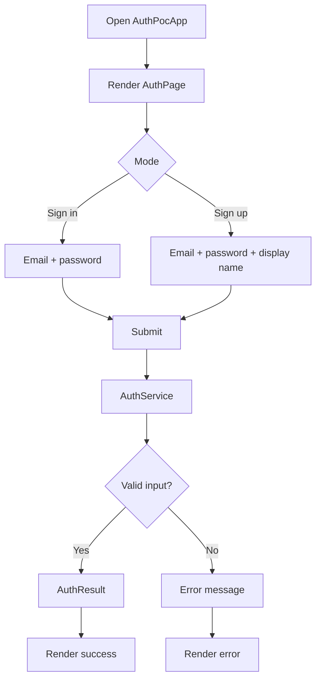
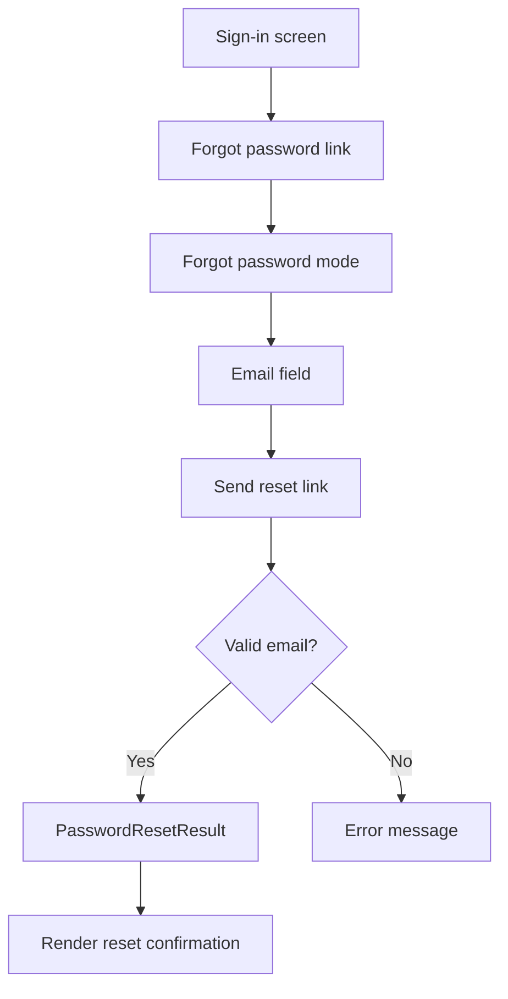
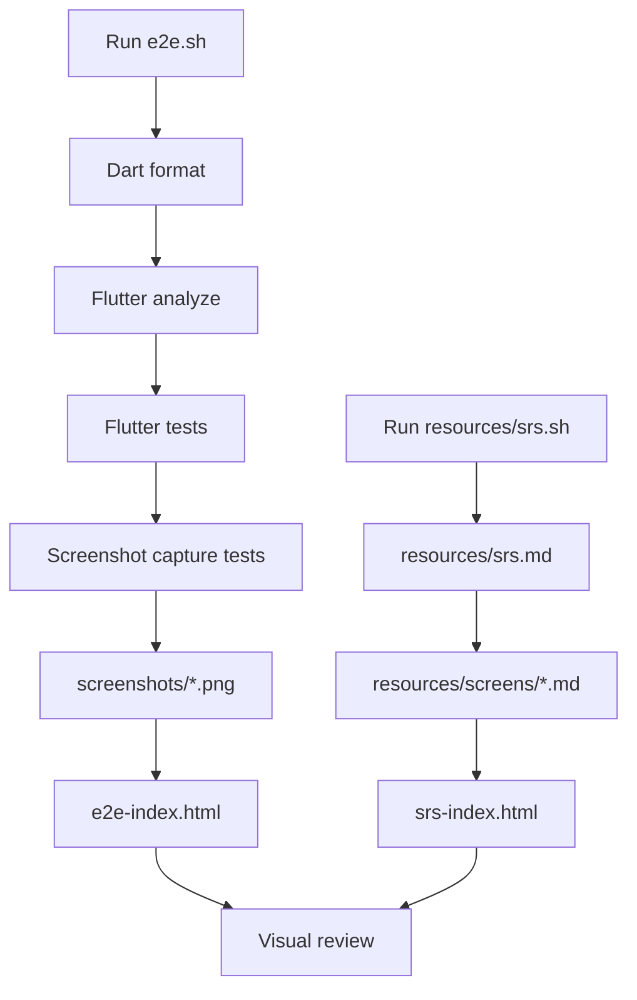

# Software Requirements Specification: Flutter POC Auth

## 1. Purpose

This SRS documents the Flutter POC auth feature generated with the `add-feat` and `add-srs` workflows. The intended outcome is a small, auditable demo for sign-in, sign-up, forgot password, screenshot e2e, and generated report flows with traceability from user stories to tests.

## 2. Scope

The POC supports:

- Sign-in with demo email and password.
- Sign-up with email, password, and display name.
- Forgot password reset-link request with email validation.
- Loading, success, and error UI states.
- Local deterministic `AuthService` boundary.
- Unit, widget, integration, screenshot, and e2e report tests.
- Generated `e2e-index.html` and `srs-index.html` reports with traceability back to user stories, screen layouts, and screenshot artifacts.

The POC does not support production token storage, OAuth/OIDC, actual email delivery, biometric auth, or real identity-provider integration.

## 3. User Stories

| ID | Summary | Source |
| --- | --- | --- |
| EP01.US001 | Open auth POC and view sign-in/sign-up entry points. | `resources/user-story/ep01-auth.md` |
| EP01.US002 | Submit auth data and render success or error result. | `resources/user-story/ep01-auth.md` |
| EP01.US003 | Preview auth flow through screenshot and e2e report coverage. | `resources/user-story/ep01-auth.md` |
| EP02.US001 | Navigate to forgot password from sign-in. | `resources/user-story/ep02-forgot-password.md` |
| EP02.US002 | Submit email to receive password reset instructions. | `resources/user-story/ep02-forgot-password.md` |
| EP02.US003 | Preview forgot password through screenshot and e2e report coverage. | `resources/user-story/ep02-forgot-password.md` |

## 4. Functional Requirements

| ID | Requirement | Trace |
| --- | --- | --- |
| FR-001 | The app shall render an auth page on launch. | EP01.US001 |
| FR-002 | The app shall support switching between sign-in and sign-up modes. | EP01.US001 |
| FR-003 | The app shall submit sign-in credentials to the auth service. | EP01.US002 |
| FR-004 | The app shall submit sign-up credentials and display name to the auth service. | EP01.US002 |
| FR-005 | The app shall render successful user summary data. | EP01.US002 |
| FR-006 | The app shall render clear error messages for invalid data. | EP01.US002 |
| FR-007 | The app shall expose a forgot password flow from sign-in mode. | EP02.US001 |
| FR-008 | The app shall validate email format before submitting a reset request. | EP02.US002 |
| FR-009 | The app shall render reset-link success and error states. | EP02.US002 |
| FR-010 | The e2e runner shall execute format, analysis, Flutter tests, and screenshot capture tests. | EP01.US003, EP02.US003 |
| FR-011 | The e2e runner shall generate `e2e-index.html` with passed/failed step counts and screenshot filters. | EP01.US003, EP02.US003 |
| FR-012 | The screenshot suite shall save stable PNG artifacts under `screenshots/`. | EP01.US003, EP02.US003 |
| FR-013 | The SRS runner shall generate `srs-index.html` and render `resources/screens/*.md` under `Screens / UI Surfaces`. | EP01.US003, EP02.US003 |

## 5. Use Cases

### UC-001 Sign in

1. User opens the auth POC.
2. User keeps sign-in mode selected.
3. User enters email and password.
4. User submits.
5. App shows returned user summary or error.

### UC-002 Sign up

1. User opens the auth POC.
2. User switches to sign-up mode.
3. User enters email, password, and display name.
4. User submits.
5. App shows returned user summary or error.

### UC-003 Forgot password

1. User opens the auth POC.
2. User taps `Forgot password?`.
3. User enters a valid email address.
4. User submits reset request.
5. App shows reset-link confirmation or validation error.

### UC-004 Generate visual verification reports

1. Developer runs `./e2e.sh`.
2. Runner executes format, analysis, Flutter tests, and screenshot capture tests.
3. Runner writes screenshot PNG files under `screenshots/`.
4. Runner generates `e2e-index.html` with summary counts, filters, and screenshot grid.
5. Developer runs `./resources/srs.sh`.
6. Runner generates `srs-index.html` with user stories, requirements, screen layouts, traceability, and verification commands.

## 6. Flow Diagram



### Forgot Password Flow



### Report Generation Flow



## 7. Entities

| Entity | Fields | Purpose |
| --- | --- | --- |
| `AuthCredentials` | `email`, `password`, `displayName` | User-submitted auth data. |
| `AuthResult` | `userId`, `email`, `displayName` | Successful auth response. |
| `PasswordResetResult` | `email`, `message` | Successful forgot password response. |
| `AuthSubmissionState` | `loading`, `result`, `resetResult`, `error` | UI state for submission. |

## 8. Screens / UI Surfaces

| Screen | Layout Source | Type |
| --- | --- | --- |
| Auth sign-in/sign-up | `resources/screens/ep01-auth-screen.md` | ASCII layout document |
| Forgot password | `resources/screens/ep02-forgot-password-screen.md` | ASCII layout document |
| E2E report | `e2e-index.html` | Generated HTML report |
| SRS report | `srs-index.html` | Generated HTML report |

## 9. Non-Functional Requirements

- The POC must stay local and deterministic.
- The POC must not store passwords or tokens.
- The UI should remain readable on mobile and web-sized screens.
- Tests should run without external services.
- Screenshot names must remain stable for report filtering and traceability.
- HTML reports must be generated locally and link e2e output back to SRS output.

## 10. Traceability

| Artifact | Path |
| --- | --- |
| App entry | `lib/main.dart` |
| UI | `lib/src/auth_page.dart` |
| Models | `lib/src/auth_models.dart` |
| Service | `lib/src/auth_service.dart` |
| Unit test | `test/auth_service_test.dart` |
| Widget test | `test/auth_flow_widget_test.dart` |
| Integration test | `integration_test/auth_flow_test.dart` |
| Auth screenshot test | `test/auth_screenshot_test.dart` |
| Auth screenshot artifact | `screenshots/ep01-auth-sign-in-form.png` |
| Forgot password screenshot test | `test/forgot_password_screenshot_test.dart` |
| Forgot password screenshot artifact | `screenshots/ep02-forgot-password-form.png` |
| Forgot password success screenshot artifact | `screenshots/ep02-forgot-password-success.png` |
| E2E runner | `e2e.sh` |
| E2E report | `e2e-index.html` |
| SRS runner | `resources/srs.sh` |
| SRS report | `srs-index.html` |
| Technical design | `resources/technial-design/ep01-auth.md` |
| Auth screen layout | `resources/screens/ep01-auth-screen.md` |
| Forgot password technical design | `resources/technial-design/ep02-forgot-password.md` |
| Forgot password screen layout | `resources/screens/ep02-forgot-password-screen.md` |

## 11. Verification

```bash
flutter pub get
dart format --set-exit-if-changed .
flutter analyze
flutter test
./e2e.sh
./resources/srs.sh
```
