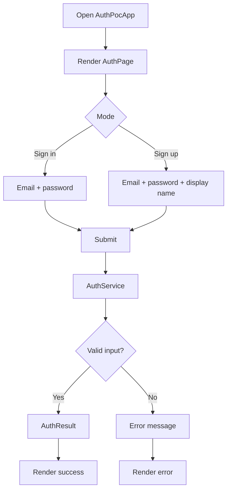

# Software Requirements Specification: Flutter POC Auth

## 1. Purpose

This SRS documents the Flutter POC auth feature generated with the `add-feat` and `add-srs` workflows. The intended outcome is a small, auditable demo for sign-in and sign-up flows with traceability from user stories to tests.

## 2. Scope

The POC supports:

- Sign-in with demo email and password.
- Sign-up with email, password, and display name.
- Loading, success, and error UI states.
- Local deterministic `AuthService` boundary.
- Unit and integration tests.

The POC does not support production token storage, OAuth/OIDC, password recovery, biometric auth, or real identity-provider integration.

## 3. User Stories

| ID | Summary | Source |
| --- | --- | --- |
| EP01.US001 | Open auth POC and view sign-in/sign-up entry points. | `resources/user-story/ep01-auth.md` |
| EP01.US002 | Submit auth data and render success or error result. | `resources/user-story/ep01-auth.md` |
| EP01.US003 | Preview auth flow through e2e/integration coverage. | `resources/user-story/ep01-auth.md` |

## 4. Functional Requirements

| ID | Requirement | Trace |
| --- | --- | --- |
| FR-001 | The app shall render an auth page on launch. | EP01.US001 |
| FR-002 | The app shall support switching between sign-in and sign-up modes. | EP01.US001 |
| FR-003 | The app shall submit sign-in credentials to the auth service. | EP01.US002 |
| FR-004 | The app shall submit sign-up credentials and display name to the auth service. | EP01.US002 |
| FR-005 | The app shall render successful user summary data. | EP01.US002 |
| FR-006 | The app shall render clear error messages for invalid data. | EP01.US002 |

## 5. Use Cases

### UC-001 Sign in

1. User opens the auth POC.
2. User keeps sign-in mode selected.
3. User enters email and password.
4. User submits.
5. App shows returned user summary or error.

### UC-002 Sign up

1. User opens the auth POC.
2. User switches to sign-up mode.
3. User enters email, password, and display name.
4. User submits.
5. App shows returned user summary or error.

## 6. Flow Diagram



## 7. Entities

| Entity | Fields | Purpose |
| --- | --- | --- |
| `AuthCredentials` | `email`, `password`, `displayName` | User-submitted auth data. |
| `AuthResult` | `userId`, `email`, `displayName` | Successful auth response. |
| `AuthSubmissionState` | `loading`, `result`, `error` | UI state for submission. |

## 8. Non-Functional Requirements

- The POC must stay local and deterministic.
- The POC must not store passwords or tokens.
- The UI should remain readable on mobile and web-sized screens.
- Tests should run without external services.

## 9. Traceability

| Artifact | Path |
| --- | --- |
| App entry | `lib/main.dart` |
| UI | `lib/src/auth_page.dart` |
| Models | `lib/src/auth_models.dart` |
| Service | `lib/src/auth_service.dart` |
| Unit test | `test/auth_service_test.dart` |
| Integration test | `integration_test/auth_flow_test.dart` |
| E2E runner | `e2e.sh` |
| Technical design | `resources/technial-design/ep01-auth.md` |

## 10. Verification

```bash
flutter pub get
dart format --set-exit-if-changed .
flutter analyze
flutter test
./resources/srs.sh
```
