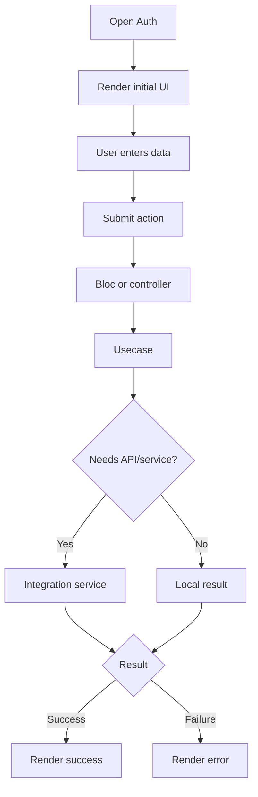

# EP01 Technical Design: Auth

## Technologies
- Flutter Material UI.
- Feature UI under `lib/presentation/auth`.
- BLoC/controller state management when needed.
- Usecase layer for business logic.
- Integration service for API/platform calls.
- Unit, widget, integration, and screenshot e2e tests.

## Entry Points
- `lib/presentation/auth/` (create when implementing)

## Flow
1. User opens Auth.
2. UI renders initial state.
3. User enters data and submits.
4. UI dispatches feature event/action.
5. Usecase validates and calls repository/service.
6. Integration service calls API/platform boundary when needed.
7. UI renders success or error state.

## Flow Diagram


## Entities
| Entity | Purpose | Fields |
|---|---|---|
| AuthRequest | User-submitted input | Add fields during implementation |
| AuthResult | Service/usecase output | Add fields during implementation |
| AuthState | UI state | initial, loading, success, error |

## Tests
- Unit tests for usecase/service behavior.
- Widget tests for form rendering and validation.
- Integration tests for the main user flow.
- Screenshot e2e runner in `e2e/e2e-ep01-auth.sh`.

## Verification
```bash
flutter test
./resources/srs.sh
```
