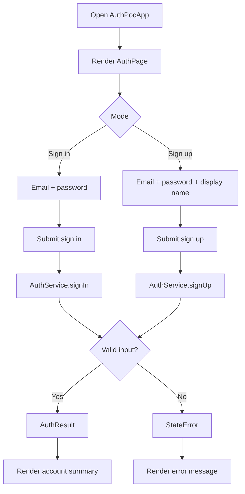

# EP01 Technical Design: Auth

## Technologies
- Flutter Material UI.
- Feature UI integrated into `lib/src/auth_page.dart`.
- Local stateful page controller for mode, loading, success, and error states.
- Local deterministic `AuthService` boundary.
- ASCII layout source in `resources/screens/ep01-auth-screen.md`.
- Unit, widget, integration, and screenshot e2e tests.

## Entry Points
- `lib/main.dart` (`AuthPocApp`)
- `lib/src/auth_page.dart` (`AuthPage`)
- `lib/src/auth_service.dart` (`AuthService.signIn()` and `AuthService.signUp()`)
- `lib/src/auth_models.dart` (`AuthMode`, `AuthCredentials`, `AuthResult`, `AuthSubmissionState`)

## Flow
1. User opens Auth.
2. UI renders sign-in mode with demo email/password.
3. User submits sign-in or switches to sign-up mode.
4. UI builds `AuthCredentials`.
5. Page calls `AuthService.signIn()` or `AuthService.signUp()`.
6. Service validates local deterministic input and returns `AuthResult` or throws `StateError`.
7. UI renders loading, success, or error state.

## Flow Diagram


## Entities
| Entity | Purpose | Fields |
|---|---|---|
| `AuthMode` | UI mode selector | `signIn`, `signUp`, `forgotPassword` |
| `AuthCredentials` | User-submitted auth data | `email`, `password`, `displayName` |
| `AuthResult` | Successful auth response | `userId`, `email`, `displayName` |
| `AuthSubmissionState` | UI submission state | `loading`, `result`, `resetResult`, `error` |

## Screen Layout
- Source: `resources/screens/ep01-auth-screen.md`
- Type: ASCII layout document with box-drawing wireframe, components, states, and events.
- SRS export: `resources/srs.sh` renders this screen under `Screens / UI Surfaces` in `srs-index.html`.

## Tests
- Unit tests in `test/auth_service_test.dart` for `signIn()`, `signUp()`, and validation behavior.
- Widget tests in `test/auth_flow_widget_test.dart` for sign-in and sign-up success states.
- Integration test in `integration_test/auth_flow_test.dart` for the combined auth and forgot password flow.
- Screenshot test in `test/auth_screenshot_test.dart` captures `screenshots/ep01-auth-sign-in-form.png`.
- E2E runner `e2e.sh` runs format, analysis, Flutter tests, screenshot captures, and generates `e2e-index.html`.
- SRS runner `resources/srs.sh` generates `srs-index.html` with screen layout export.

## Verification
```bash
dart format --set-exit-if-changed .
flutter analyze
flutter test
./e2e.sh
./resources/srs.sh
```
