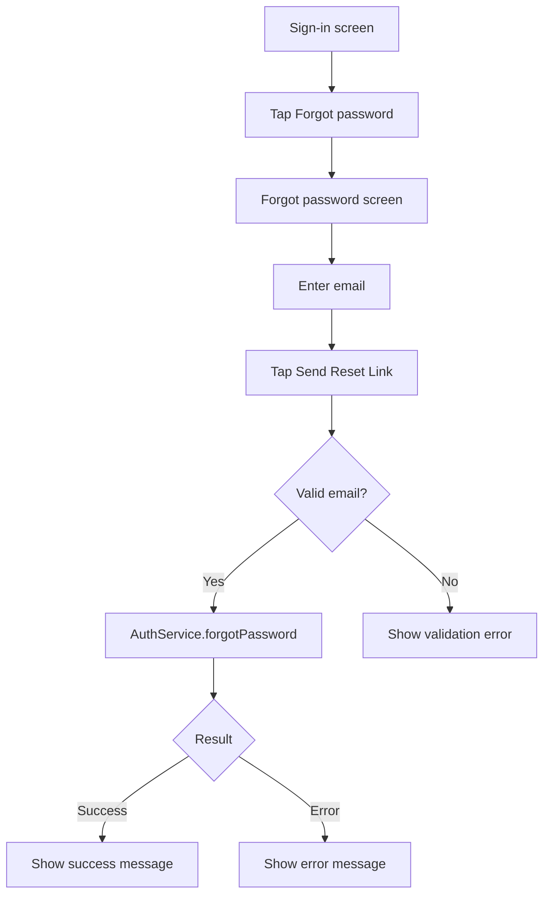

# EP02 Technical Design: Forgot Password

## Technologies
- Flutter Material UI.
- Feature UI integrated into existing `lib/src/auth_page.dart`.
- Local deterministic `AuthService` boundary.
- ASCII layout source in `resources/screens/ep02-forgot-password-screen.md`.
- Unit, widget, integration, and screenshot e2e tests.

## Entry Points
- `lib/src/auth_page.dart` (add `AuthMode.forgotPassword`)
- `lib/src/auth_service.dart` (add `forgotPassword()` method)
- `lib/src/auth_models.dart` (add `PasswordResetResult`)

## Flow
1. User is on sign-in screen.
2. User taps `Forgot password?` from sign-in mode.
3. UI switches to `AuthMode.forgotPassword`.
4. User enters email.
5. User taps "Send Reset Link".
6. `AuthService.forgotPassword()` returns local deterministic success or throws validation error.
7. UI renders success message or error state.

## Flow Diagram


## Entities
| Entity | Purpose | Fields |
|---|---|---|
| `AuthMode.forgotPassword` | UI mode for reset flow | enum value |
| `PasswordResetResult` | Forgot password response | `email`, `message` |

## Screen Layout
- Source: `resources/screens/ep02-forgot-password-screen.md`
- Type: ASCII layout document with box-drawing wireframe, components, states, and events.
- SRS export: `resources/srs.sh` renders this screen under `Screens / UI Surfaces` in `srs-index.html`.

## Tests
- Unit tests in `test/auth_service_test.dart` cover `AuthService.forgotPassword()` success and invalid-email rejection.
- Widget tests in `test/auth_flow_widget_test.dart` cover navigation, submission, success state, and return to sign-in.
- Integration test in `integration_test/auth_flow_test.dart` covers forgot password navigation and reset submission after auth flows.
- Screenshot test in `test/forgot_password_screenshot_test.dart` captures:
  - `screenshots/ep02-forgot-password-form.png`
  - `screenshots/ep02-forgot-password-success.png`
- E2E runner `e2e.sh` includes forgot password screenshot capture and generates `e2e-index.html`.
- SRS runner `resources/srs.sh` generates `srs-index.html` with this ASCII layout embedded in `Screens / UI Surfaces`.

## Verification
```bash
dart format --set-exit-if-changed .
flutter analyze
flutter test
./e2e.sh
./resources/srs.sh
```
