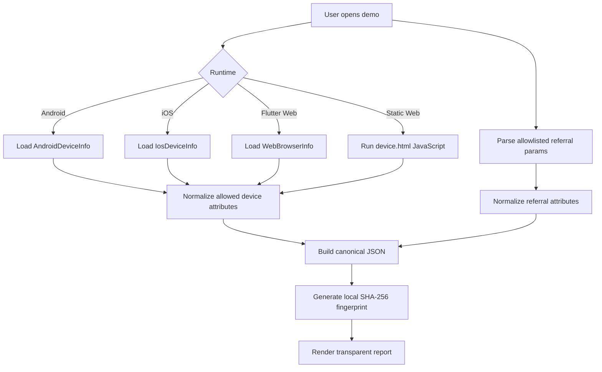

# Flutter POC Fingerprint

Privacy-safe device and referral attributes demo for Android, iOS, Flutter Web, and a static Web page.

This POC shows how to load normal platform/browser metadata, parse allowlisted referral parameters, and generate a deterministic local SHA-256 hash. It is designed for transparent mobile referral testing, not covert tracking.

## Features

- Android device info via `device_info_plus`.
- iOS device info via `device_info_plus`.
- Flutter Web browser info via `device_info_plus`.
- Static `web/device.html` using plain HTML, CSS, and JavaScript.
- SHA-256 hash generated from normalized allowed attributes.
- Referral param allowlist to avoid storing tokens or secrets.
- No third-party IP service.
- No canvas/audio/WebGL/font fingerprinting.

## Flow



## Attribute summary

| Group | Attributes |
| --- | --- |
| Device | platform, platformVersion, model, manufacturer, isPhysicalDevice |
| Web | browserName, browserVersion, userAgent, vendor, hardwareConcurrency |
| UI | locale, timezone, screen, devicePixelRatio, colorScheme |
| Referral | ref, referral, utm_source, utm_medium, utm_campaign, utm_term, utm_content, click_id, fbclid, gclid, campaign |
| Privacy | localOnly, thirdPartyIpLookup=false, invasiveFingerprinting=false |

## IP limitation

Public IP is not available reliably from a Flutter/browser client. This POC does not call third-party IP APIs. If production needs IP, use a documented same-origin backend endpoint and disclose that collection in the product UI/privacy policy.

## Run

```bash
flutter pub get
flutter run -d chrome
flutter run -d android
flutter run -d ios
```

Static Web page:

```bash
open web/device.html
```

Or serve it locally:

```bash
python3 -m http.server 8080 --directory web
```

Then open:

```text
http://localhost:8080/device.html?ref=test&utm_source=mobile&token=secret
```

The demo should include `ref` and `utm_source`, and ignore `token`.

## Validate

```bash
dart format --set-exit-if-changed .
flutter analyze
```

## Notes

- Treat the hash as a local debug/referral signal, not a permanent identity.
- Do not add advertising IDs, serial numbers, installed apps, contacts, files, precise location, or high-entropy browser probes.
- Keep the collected JSON visible to the user during implementation and QA.
