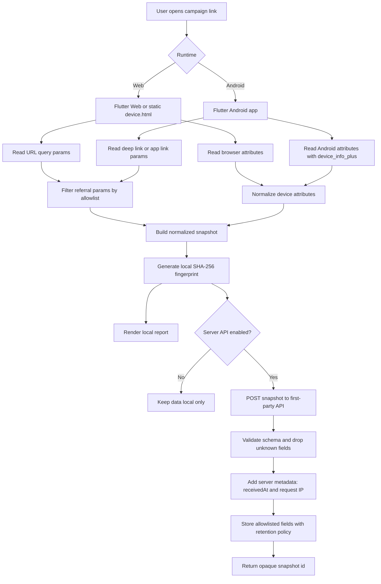
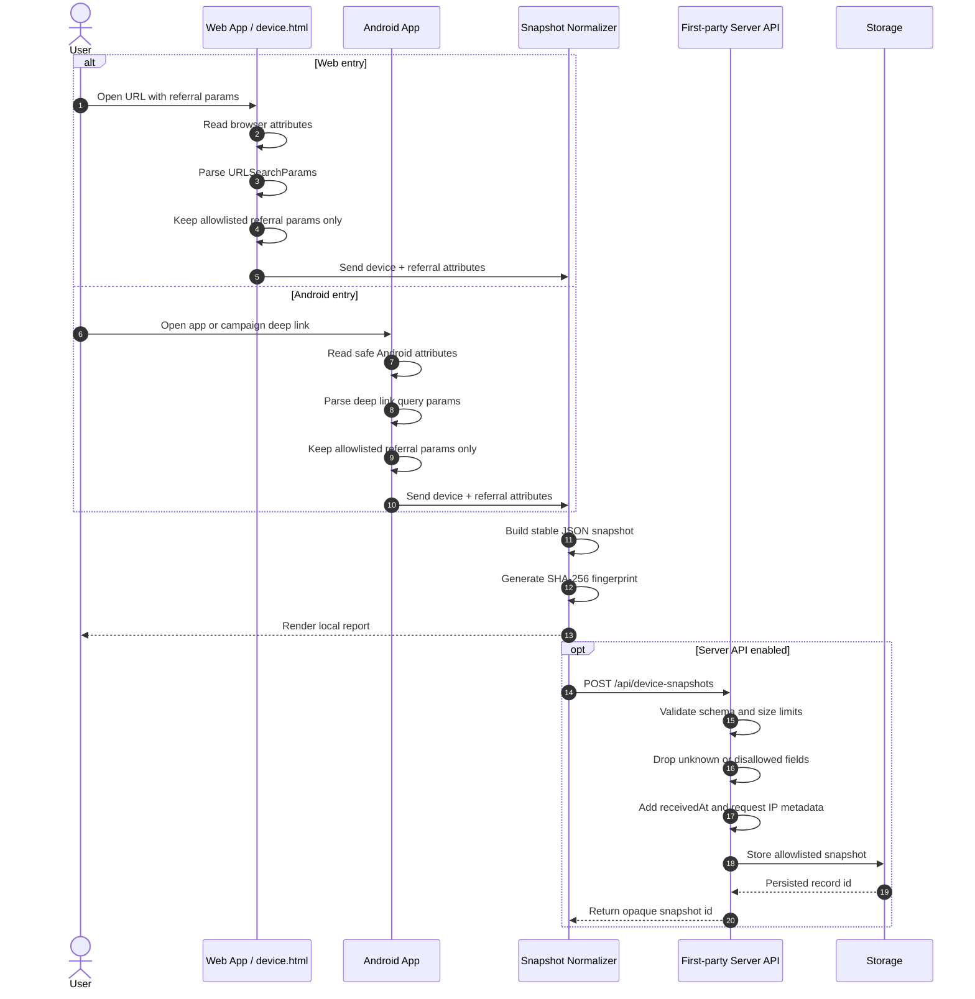
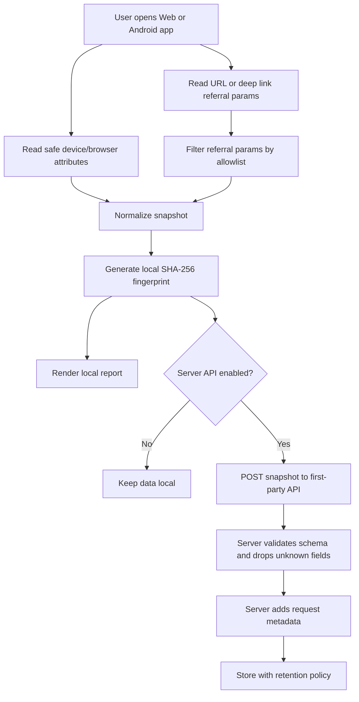

# Technical Integration: Privacy-Safe Device and Referral Attributes

This document describes how to integrate privacy-safe device, browser, referral, and local fingerprint attributes across Web, Android, and a first-party Server API.

The goal is attribution and diagnostics, not covert tracking. The implementation must stay transparent, local-first, and limited to low-risk attributes.

## Scope

This POC supports:

- Flutter Web device/browser attribute collection.
- Android app device attribute collection.
- Referral parameter parsing from URL/deep link inputs.
- Deterministic local hash generation for a normalized snapshot.
- Optional first-party Server API ingestion.

This POC does not support:

- Third-party IP lookup services.
- Advertising IDs such as IDFA, AAID, or GAID.
- Hardware serial numbers, IMEI, IMSI, MAC address, or Android ID.
- Installed app scans.
- Contacts, files, photos, clipboard, location, or sensor collection.
- Canvas, audio, WebGL, font, or other high-entropy browser fingerprinting.
- Biometric access such as Face ID, Touch ID, or fingerprint authentication.

## Attribute Contract

### Device Attributes

| Field | Web | Android | Server | Notes |
| --- | --- | --- | --- | --- |
| `appRuntime` | Yes | Yes | Optional | Example: `flutter-web`, `flutter-android`, `server-api`. |
| `platform` | Yes | Yes | Optional | Example: `web`, `android`. |
| `platformVersion` | Yes | Yes | Optional | Browser app version or Android release. |
| `browserName` | Yes | No | No | From browser APIs or `device_info_plus`. |
| `browserVersion` | Yes | No | No | Low confidence; browser UA can be reduced. |
| `userAgent` | Yes | No | Optional | Store only if needed. Treat as personal data in many jurisdictions. |
| `manufacturer` | No | Yes | No | Example: `Google`, `Samsung`. |
| `model` | No | Yes | No | Example: `Pixel 8`. Avoid serial/device IDs. |
| `sdkInt` | No | Yes | No | Android SDK version. |
| `isPhysicalDevice` | No | Yes | No | Useful for diagnostics. |
| `locale` | Yes | Yes | Optional | Example: `en-US`. |
| `timezone` | Yes | Yes | Optional | Use local timezone name only. |
| `screen` | Yes | Yes | No | Example: `390x844`. Avoid high-entropy probing. |
| `devicePixelRatio` | Yes | Yes | No | Basic display attribute. |
| `colorScheme` | Yes | Yes | No | `light` or `dark`. |
| `ipAddress` | No | No | Yes | Only available from first-party server request metadata. |

### Referral Attributes

Only allow these query parameters:

- `ref`
- `referral`
- `utm_source`
- `utm_medium`
- `utm_campaign`
- `utm_term`
- `utm_content`
- `click_id`
- `fbclid`
- `gclid`
- `campaign`

Ignore all other query parameters, especially sensitive values such as `token`, `email`, `phone`, `session`, `password`, `auth`, or arbitrary IDs.

## End-to-End Processing Flow



## Web, Mobile, and Server Sequence



## Server API Processing Flow

```mermaid
flowchart LR
    A[Receive POST /api/device-snapshots] --> B[Check content type and body size]
    B --> C[Validate top-level schema]
    C --> D[Validate device field allowlist]
    D --> E[Validate referral field allowlist]
    E --> F[Drop unknown fields]
    F --> G[Detect and reject secret-like values]
    G --> H[Attach server receivedAt]
    H --> I[Read request IP from trusted proxy metadata]
    I --> J[Hash or truncate IP if required]
    J --> K[Store snapshot]
    K --> L[Return opaque id]
```



## Web Integration

Web integration has two variants:

1. Flutter Web page.
2. Static HTML/CSS/JS page at `web/device.html`.

### Flutter Web Flow

1. User opens the Flutter Web app with optional referral parameters.
2. The app reads `Uri.base`.
3. The referral loader filters query parameters through the allowlist.
4. The device loader reads low-risk browser attributes.
5. The app normalizes the snapshot.
6. The app generates a SHA-256 hash from stable normalized fields.
7. The app renders the result locally.
8. Optional: the app sends the snapshot to a first-party Server API.

### Static Web Flow

The static `device.html` page uses browser APIs only:

- `navigator.userAgent`
- `navigator.platform`
- `navigator.language`
- `navigator.languages`
- `navigator.hardwareConcurrency`
- `screen.width`
- `screen.height`
- `window.devicePixelRatio`
- `document.referrer`
- `URLSearchParams`
- `crypto.subtle.digest('SHA-256')`

Do not add canvas, audio, WebGL, font measurement, or hidden iframe probes.

### Web Example Payload

```json
{
  "source": "flutter-web",
  "device": {
    "appRuntime": "flutter-web",
    "platform": "web",
    "browserName": "chrome",
    "browserVersion": "Mozilla/5.0...",
    "userAgent": "Mozilla/5.0...",
    "locale": "en-US",
    "timezone": "ICT",
    "screen": "1440x900",
    "devicePixelRatio": 2,
    "colorScheme": "dark",
    "ipAddress": "Unavailable without a same-origin backend endpoint"
  },
  "referral": {
    "utm_source": "newsletter",
    "utm_campaign": "launch"
  },
  "fingerprint": "sha256-hex"
}
```

## Android Integration

Android integration uses Flutter plus `device_info_plus`.

### Android Flow

1. User installs or opens the Android app.
2. If opened from a campaign link, the app receives a deep link or app link.
3. The app extracts referral query parameters from the incoming URI.
4. The referral loader filters parameters through the allowlist.
5. `device_info_plus.androidInfo` reads safe Android fields.
6. The app normalizes the snapshot.
7. The app generates a SHA-256 local fingerprint.
8. Optional: the app posts the snapshot to the first-party Server API.

### Android Safe Fields

Use:

- `version.release`
- `version.sdkInt`
- `manufacturer`
- `model`
- `isPhysicalDevice`

Do not use:

- Android ID.
- Advertising ID.
- IMEI.
- IMSI.
- SIM identifiers.
- MAC address.
- Serial number.
- Installed app list.
- Contacts, files, photos, clipboard, precise location, or sensors.

### Android Permissions

No Android permissions are required for the current POC.

Do not add:

```xml
<uses-permission android:name="android.permission.USE_BIOMETRIC" />
<uses-permission android:name="android.permission.USE_FINGERPRINT" />
```

Those permissions are only needed for biometric authentication flows. This POC does not use biometric authentication and must not imply that biometric data is collected.

### Android Deep Link Example

If the production app needs campaign links, define a first-party link format first, for example:

```text
https://example.com/open?utm_source=ads&utm_campaign=spring&ref=partner-a
```

Then configure Android App Links in `AndroidManifest.xml` only after the domain and path are confirmed.

Example intent filter shape:

```xml
<intent-filter android:autoVerify="true">
    <action android:name="android.intent.action.VIEW" />
    <category android:name="android.intent.category.DEFAULT" />
    <category android:name="android.intent.category.BROWSABLE" />
    <data
        android:scheme="https"
        android:host="example.com"
        android:pathPrefix="/open" />
</intent-filter>
```

The domain must host a valid `assetlinks.json` file before Android App Links verification will work.

## Server API Integration

A Server API is optional. Use it only when the product needs attribution persistence, analytics, diagnostics, or fraud-risk review.

The server must be first-party. Do not send this data to third-party fingerprinting or IP enrichment services.

### Server Responsibilities

The server can:

- Receive normalized snapshots from Web and Android.
- Add request metadata such as IP address and server receive time.
- Validate the schema.
- Drop disallowed fields.
- Store only allowlisted attributes.
- Apply retention limits.
- Return an opaque server-side record ID.

The server must not:

- Enrich IP through third-party services.
- Store raw secrets from query strings.
- Accept arbitrary client-supplied keys.
- Trust the client fingerprint as an identity proof.
- Use the fingerprint as a login credential.

### Endpoint

```http
POST /api/device-snapshots
Content-Type: application/json
```

### Request Body

```json
{
  "source": "flutter-android",
  "collectedAt": "2026-05-19T10:00:00.000Z",
  "fingerprint": "sha256-hex",
  "device": {
    "appRuntime": "flutter-android",
    "platform": "android",
    "platformVersion": "15",
    "manufacturer": "Google",
    "model": "Pixel 8",
    "sdkInt": 35,
    "isPhysicalDevice": true,
    "locale": "en-US",
    "timezone": "ICT",
    "screen": "412x915",
    "devicePixelRatio": 2.75,
    "colorScheme": "light",
    "ipAddress": "Unavailable without a same-origin backend endpoint"
  },
  "referral": {
    "utm_source": "partner",
    "utm_campaign": "android-launch",
    "ref": "creator-123"
  },
  "privacy": {
    "localOnly": false,
    "thirdPartyIpLookup": false,
    "invasiveFingerprinting": false
  }
}
```

### Response Body

```json
{
  "id": "devsnap_01HX...",
  "receivedAt": "2026-05-19T10:00:01.000Z",
  "source": "flutter-android"
}
```

### Server-Side IP Handling

The client cannot reliably know its public IP without calling a network service. If IP is needed, capture it on the first-party server from request metadata.

Recommended behavior:

- Store the raw IP only if the product and legal requirements allow it.
- Prefer storing a salted hash or truncated IP for analytics.
- Do not call third-party IP lookup or geolocation services.
- Do not expose the server-observed IP back to the client unless needed.

Example server-derived fields:

```json
{
  "server": {
    "receivedAt": "2026-05-19T10:00:01.000Z",
    "ipAddress": "203.0.113.10",
    "ipHash": "sha256(server-salt + ip)",
    "userAgent": "request header user-agent"
  }
}
```

### Validation Rules

The Server API should reject or drop:

- Unknown top-level keys.
- Unknown `device` fields.
- Unknown `referral` fields.
- Empty or oversized string values.
- Query values that look like secrets.
- Payloads above a small fixed size limit.

Suggested limits:

- Request body: max 16 KB.
- String field: max 512 characters.
- Referral value: max 256 characters.
- User agent: max 1024 characters.

### Storage Model

Example table shape:

```sql
CREATE TABLE device_snapshots (
  id TEXT PRIMARY KEY,
  source TEXT NOT NULL,
  fingerprint TEXT NOT NULL,
  collected_at TIMESTAMP NOT NULL,
  received_at TIMESTAMP NOT NULL,
  device_json JSONB NOT NULL,
  referral_json JSONB NOT NULL,
  ip_hash TEXT,
  created_at TIMESTAMP NOT NULL DEFAULT CURRENT_TIMESTAMP
);
```

Recommended indexes:

```sql
CREATE INDEX idx_device_snapshots_fingerprint ON device_snapshots (fingerprint);
CREATE INDEX idx_device_snapshots_received_at ON device_snapshots (received_at);
CREATE INDEX idx_device_snapshots_referral_source ON device_snapshots ((referral_json->>'utm_source'));
```

Set a retention period. For example, delete raw snapshots after 30-90 days unless there is a clear product/legal reason to keep them longer.

## Fingerprint Generation

The fingerprint is a deterministic hash of normalized low-risk fields.

Recommended input:

```json
{
  "source": "flutter-android",
  "device": {
    "platform": "android",
    "platformVersion": "15",
    "manufacturer": "Google",
    "model": "Pixel 8",
    "sdkInt": 35,
    "locale": "en-US",
    "timezone": "ICT"
  },
  "referral": {
    "utm_source": "partner",
    "utm_campaign": "android-launch"
  }
}
```

Do not include:

- Public IP by default.
- Exact timestamps.
- Random session IDs.
- Access tokens.
- Emails or phone numbers.
- Hardware identifiers.

The fingerprint is not a user identity. It can change after OS updates, browser privacy changes, device replacement, locale changes, or app reinstall behavior.

## Privacy and Security Checklist

Before shipping:

- Confirm no biometric permissions are present.
- Confirm no third-party IP service is called.
- Confirm no advertising ID dependency is added.
- Confirm no invasive browser fingerprinting APIs are used.
- Confirm referral params are allowlisted.
- Confirm unknown query params are ignored.
- Confirm payload size limits exist on the Server API.
- Confirm retention policy is documented.
- Confirm users can understand what is collected and why.

## Recommended Production Flow



## Implementation Notes for This POC

Relevant files:

- `lib/device_info_loader.dart`: loads Web, Android, and iOS safe device attributes.
- `lib/referral_info_loader.dart`: filters referral parameters through the allowlist.
- `lib/models.dart`: normalizes snapshots and builds SHA-256 fingerprint.
- `lib/main.dart`: renders the local report UI.
- `web/device.html`: standalone static web demo.
- `android/app/src/main/AndroidManifest.xml`: Android app manifest; no extra permissions required.
- `ios/Runner/Info.plist`: iOS app metadata; no Face ID usage string required.

Keep this example permissionless unless a future feature explicitly adds authentication, deep links, or server submission.
