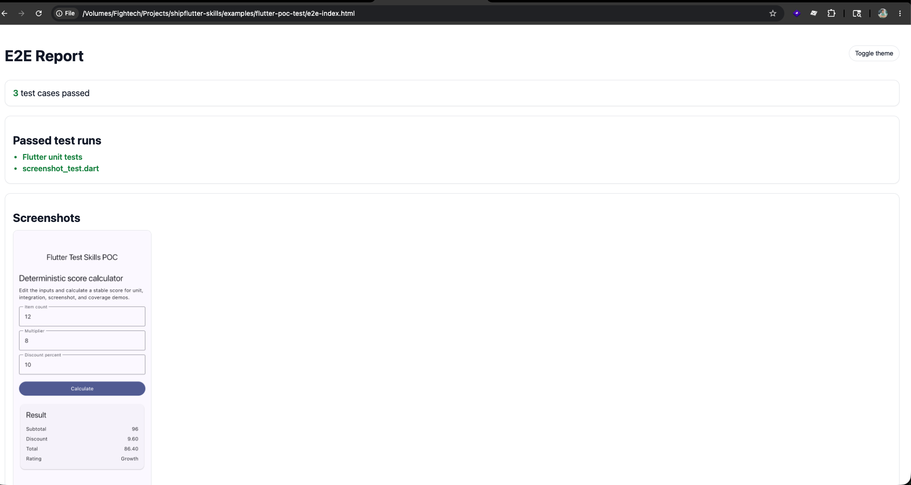

# Flutter POC Test

Demo Flutter app for three testing skills:

- `flutter-unit-test-coverage`: unit/widget tests plus coverage scripts.
- `flutter-integration-test`: `integration_test` flow without screenshots.
- `flutter-driver-screenshot-test`: `flutter drive` flow that saves screenshots on the host.

## App



The app is a deterministic score calculator. It uses fixed inputs by default:

- count: `12`
- multiplier: `8`
- discount: `10`
- total: `86.40`
- rating: `Growth`

No network, timers, randomness, device plugins, or DateTime are used.

## Files

- `lib/src/score_calculator.dart`: pure business logic for unit coverage.
- `test/score_calculator_test.dart`: unit tests.
- `test/widget_test.dart`: widget tests.
- `integration_test/app_test.dart`: normal integration test, no screenshots.
- `integration_test/screenshot_test.dart`: screenshot integration target.
- `integration_test/helpers/screenshot_helper.dart`: calls `takeScreenshot`, does not write files.
- `test_driver/integration_test.dart`: host driver that writes PNG files into `screenshots/`.
- `run_test.sh`: coverage script.
- `integration_test.sh`: normal integration test script.
- `e2e.sh`: screenshot driver script.

## Commands

```bash
flutter pub get
dart format --set-exit-if-changed .
flutter analyze
flutter test
```

Coverage:

```bash
./run_test.sh --test
./run_test.sh --report
```

Normal integration test without screenshots:

```bash
./integration_test.sh
```

Screenshot driver test:

```bash
flutter devices
./e2e.sh <device-id>
```

Expected artifacts:

- `coverage/lcov.info`
- `coverage/html/index.html` when `genhtml` is installed
- `screenshots/score_calculator_home-<platform>.png`
- `e2e-index.html` with screenshot gallery and test summary

## Example Prompts for AI Agents

Use these example prompts to instruct AI agents on how to implement the `flutter-driver-screenshot-test` skill in other projects:

### Setup Flutter screenshot e2e tests

```text
Use the `flutter-driver-screenshot-test` skill.

Add Flutter driver screenshot tests to this project.

Requirements:
- Save PNG screenshots into `screenshots/` on the host machine.
- Use `integration_test_driver_extended.dart` with `onScreenshot`.
- Do not write screenshot files from `integration_test/` code.
- Create `integration_test/helpers/screenshot_helper.dart`.
- Create `integration_test/screenshot_test.dart` for the main screens.
- Create `test_driver/integration_test.dart`.
- Create `e2e.sh` in the project root.
- Generate `e2e-index.html` with screenshot previews and passed test summary.
- Parse Flutter output like `flutter: 00:07 +11: All tests passed!` to show the passed test case count.
- Include light/dark theme support with a toggle.
- Auto-open `e2e-index.html` after tests finish.
- Run validation and fix failures.

Report generated screenshot paths and the report path.
```

### Add screenshot coverage for specific screens

```text
Use the `flutter-driver-screenshot-test` skill.

Add screenshot tests for these screens: <screen list>.

Constraints:
- Use stable screenshot names.
- Include platform suffix in screenshot names.
- Keep screenshots deterministic by using fake data or stable app state.
- Run `sh e2e.sh` and verify PNG files plus `e2e-index.html` are created.
- Verify the HTML report displays the passed test count and opens automatically.
```

### Fix screenshot save failures

```text
Use the `flutter-driver-screenshot-test` skill.

The e2e screenshot test is failing. Run `sh e2e.sh`, inspect the error, and fix it.

Rules:
- If the error is read-only filesystem, move file writing to the host driver `onScreenshot` callback.
- Do not write PNG files from the app process.
- Keep screenshot helper limited to `binding.takeScreenshot(...)`.
```
