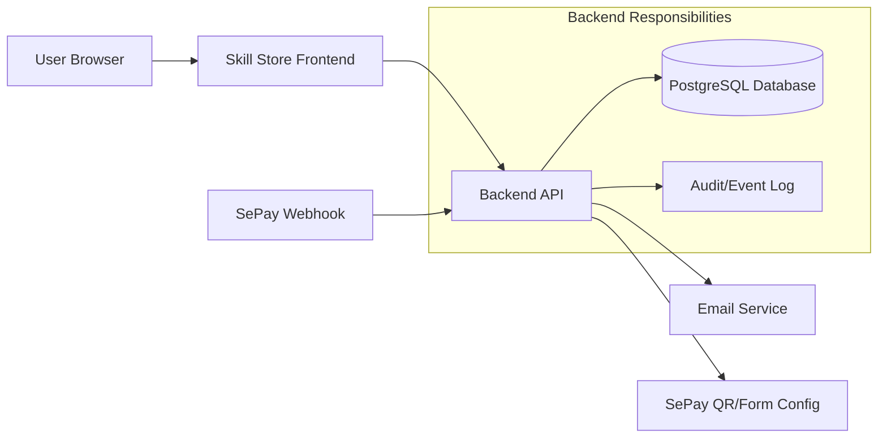
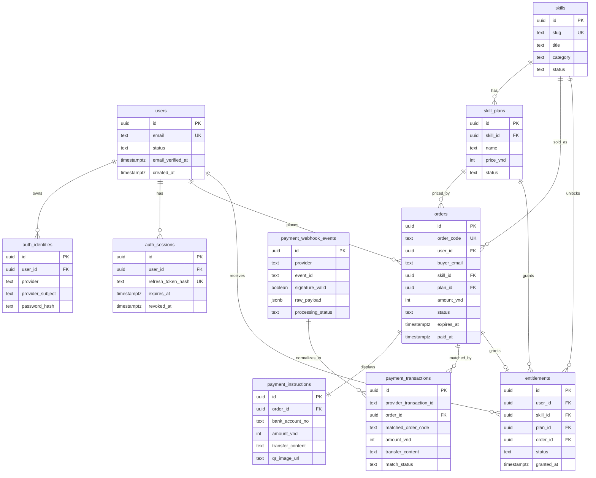
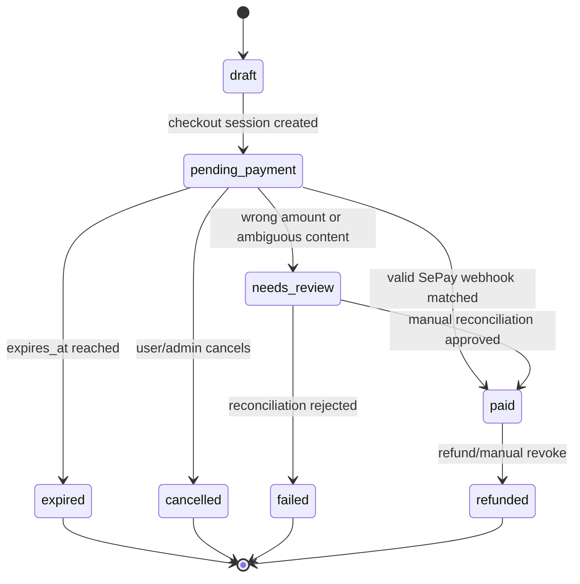
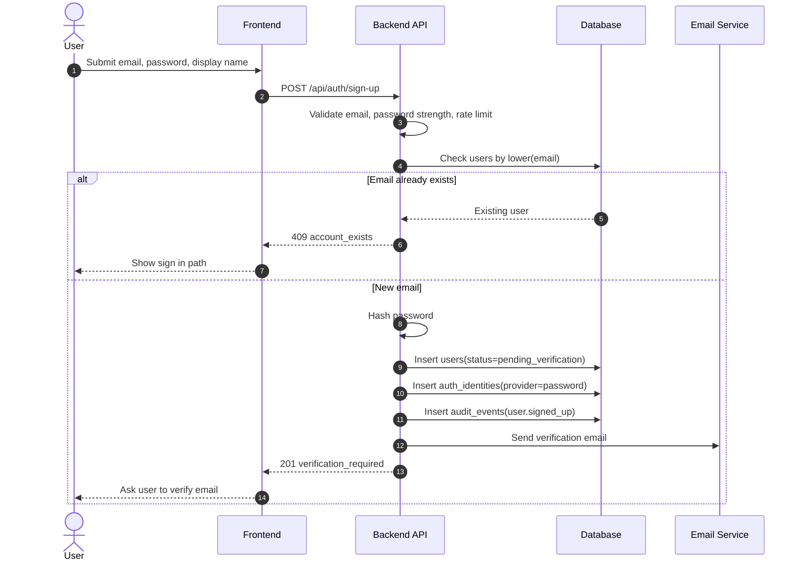
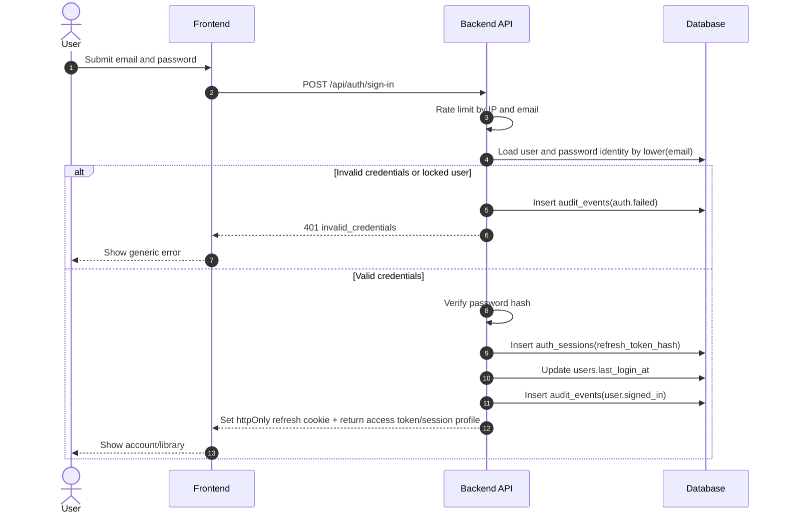
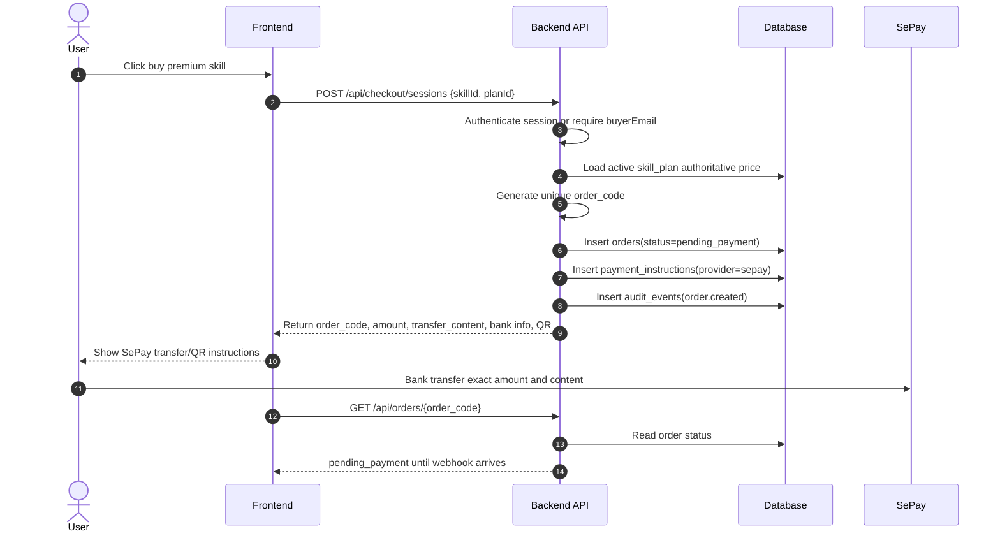
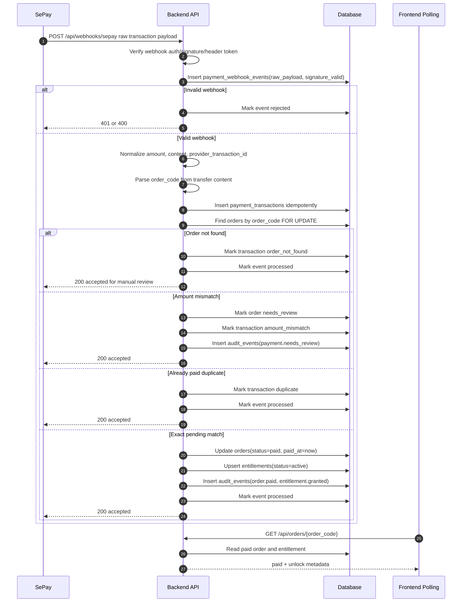
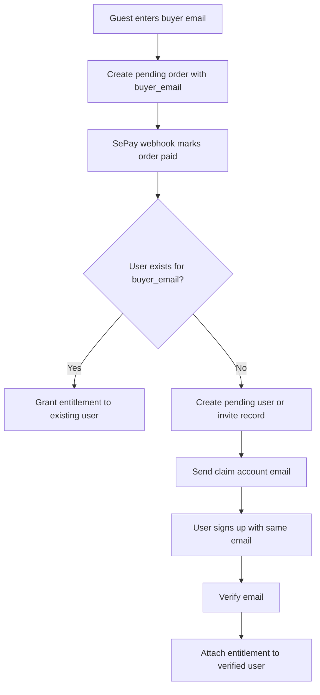

# EP01 User, Payment, and Entitlement Database Architecture

## Purpose

This document defines the production database architecture for Skill Store user accounts, authentication sessions, premium skill checkout, SePay payment reconciliation, and post-payment entitlement unlock.

The frontend may stay static, but all identity, order, payment, and access-control decisions must be handled by the backend.

## Design Principles

- Store user identity separately from authentication credentials.
- Never trust client-provided price, paid status, role, or entitlement state.
- Keep SePay webhook processing idempotent.
- Preserve raw payment payloads for audit and support.
- Use append-friendly records for payments, sessions, and entitlement changes.
- Prefer stable UUID primary keys and unique business identifiers such as `order_code`.

## High-Level System Diagram



## Core Database Tables

### `users`

Stores the buyer account profile.

| Column | Type | Constraint | Notes |
| --- | --- | --- | --- |
| `id` | UUID | PK | Internal user id. |
| `email` | TEXT | UNIQUE NOT NULL | Lowercase canonical email. |
| `display_name` | TEXT | NULL | Optional user display name. |
| `avatar_url` | TEXT | NULL | Optional profile image. |
| `status` | TEXT | NOT NULL | `active`, `pending_verification`, `locked`, `deleted`. |
| `email_verified_at` | TIMESTAMPTZ | NULL | Set after email verification. |
| `last_login_at` | TIMESTAMPTZ | NULL | Updated after successful sign in. |
| `created_at` | TIMESTAMPTZ | NOT NULL | Server timestamp. |
| `updated_at` | TIMESTAMPTZ | NOT NULL | Server timestamp. |

Indexes:

- `users_email_unique` on `lower(email)`.
- `users_status_idx` on `status`.

### `auth_identities`

Stores login methods for a user.

| Column | Type | Constraint | Notes |
| --- | --- | --- | --- |
| `id` | UUID | PK | Internal identity id. |
| `user_id` | UUID | FK `users.id` | Owner user. |
| `provider` | TEXT | NOT NULL | `password`, `google`, `github`, `magic_link`. |
| `provider_subject` | TEXT | NOT NULL | Provider account id or email. |
| `password_hash` | TEXT | NULL | Only for password provider. |
| `created_at` | TIMESTAMPTZ | NOT NULL | Server timestamp. |
| `updated_at` | TIMESTAMPTZ | NOT NULL | Server timestamp. |

Indexes:

- Unique composite index on `(provider, provider_subject)`.
- `auth_identities_user_id_idx` on `user_id`.

### `auth_sessions`

Tracks refresh/session state for signed-in users.

| Column | Type | Constraint | Notes |
| --- | --- | --- | --- |
| `id` | UUID | PK | Internal session id. |
| `user_id` | UUID | FK `users.id` | Owner user. |
| `refresh_token_hash` | TEXT | UNIQUE NOT NULL | Store hash only. |
| `user_agent` | TEXT | NULL | For audit/support. |
| `ip_address` | INET | NULL | For risk checks. |
| `expires_at` | TIMESTAMPTZ | NOT NULL | Refresh expiry. |
| `revoked_at` | TIMESTAMPTZ | NULL | Set on logout/revoke. |
| `created_at` | TIMESTAMPTZ | NOT NULL | Server timestamp. |

Indexes:

- `auth_sessions_user_id_idx` on `user_id`.
- `auth_sessions_expires_at_idx` on `expires_at`.

### `skills`

Stores sellable skill products.

| Column | Type | Constraint | Notes |
| --- | --- | --- | --- |
| `id` | UUID | PK | Internal skill id. |
| `slug` | TEXT | UNIQUE NOT NULL | Public stable slug. |
| `title` | TEXT | NOT NULL | Display title. |
| `category` | TEXT | NOT NULL | Catalog category. |
| `summary` | TEXT | NOT NULL | Short product promise. |
| `description_md` | TEXT | NULL | Product detail page copy. |
| `status` | TEXT | NOT NULL | `draft`, `active`, `archived`. |
| `created_at` | TIMESTAMPTZ | NOT NULL | Server timestamp. |
| `updated_at` | TIMESTAMPTZ | NOT NULL | Server timestamp. |

### `skill_plans`

Stores price and access variants.

| Column | Type | Constraint | Notes |
| --- | --- | --- | --- |
| `id` | UUID | PK | Internal plan id. |
| `skill_id` | UUID | FK `skills.id` | Skill product. |
| `name` | TEXT | NOT NULL | Example: `Premium`, `Team`. |
| `price_vnd` | INTEGER | NOT NULL | Authoritative price. |
| `compare_at_price_vnd` | INTEGER | NULL | Optional display price. |
| `currency` | TEXT | NOT NULL | Default `VND`. |
| `status` | TEXT | NOT NULL | `active`, `archived`. |
| `created_at` | TIMESTAMPTZ | NOT NULL | Server timestamp. |
| `updated_at` | TIMESTAMPTZ | NOT NULL | Server timestamp. |

Indexes:

- `skill_plans_skill_id_idx` on `skill_id`.
- Unique composite index on `(skill_id, name)`.

### `orders`

Stores checkout intent and authoritative order state.

| Column | Type | Constraint | Notes |
| --- | --- | --- | --- |
| `id` | UUID | PK | Internal order id. |
| `order_code` | TEXT | UNIQUE NOT NULL | Transfer content and public order lookup key. |
| `user_id` | UUID | FK `users.id`, NULL | Nullable for guest checkout before account creation. |
| `buyer_email` | TEXT | NOT NULL | Entitlement recipient email. |
| `skill_id` | UUID | FK `skills.id` | Purchased skill. |
| `plan_id` | UUID | FK `skill_plans.id` | Purchased plan. |
| `amount_vnd` | INTEGER | NOT NULL | Copied from plan at checkout time. |
| `currency` | TEXT | NOT NULL | Default `VND`. |
| `status` | TEXT | NOT NULL | `draft`, `pending_payment`, `paid`, `expired`, `needs_review`, `cancelled`, `failed`, `refunded`. |
| `payment_provider` | TEXT | NOT NULL | `sepay`. |
| `expires_at` | TIMESTAMPTZ | NOT NULL | Payment deadline. |
| `paid_at` | TIMESTAMPTZ | NULL | Set after valid payment. |
| `created_at` | TIMESTAMPTZ | NOT NULL | Server timestamp. |
| `updated_at` | TIMESTAMPTZ | NOT NULL | Server timestamp. |

Indexes:

- `orders_order_code_unique` on `order_code`.
- `orders_user_id_idx` on `user_id`.
- `orders_buyer_email_idx` on `lower(buyer_email)`.
- `orders_status_idx` on `status`.
- `orders_expires_at_idx` on `expires_at`.

### `payment_instructions`

Stores the bank transfer instruction returned to frontend.

| Column | Type | Constraint | Notes |
| --- | --- | --- | --- |
| `id` | UUID | PK | Internal instruction id. |
| `order_id` | UUID | FK `orders.id` UNIQUE | One active instruction per order. |
| `provider` | TEXT | NOT NULL | `sepay`. |
| `bank_name` | TEXT | NOT NULL | Configured receiving bank. |
| `bank_account_no` | TEXT | NOT NULL | Receiving account number. |
| `bank_account_name` | TEXT | NOT NULL | Receiving account holder. |
| `amount_vnd` | INTEGER | NOT NULL | Exact amount. |
| `transfer_content` | TEXT | NOT NULL | Must contain `order_code`. |
| `qr_payload` | TEXT | NULL | Provider QR payload if generated. |
| `qr_image_url` | TEXT | NULL | Provider/backend hosted QR image. |
| `created_at` | TIMESTAMPTZ | NOT NULL | Server timestamp. |

### `payment_transactions`

Stores normalized SePay transaction records.

| Column | Type | Constraint | Notes |
| --- | --- | --- | --- |
| `id` | UUID | PK | Internal payment transaction id. |
| `provider` | TEXT | NOT NULL | `sepay`. |
| `provider_transaction_id` | TEXT | NULL | SePay transaction id when supplied. |
| `order_id` | UUID | FK `orders.id`, NULL | Null until matched. |
| `matched_order_code` | TEXT | NULL | Parsed code from content. |
| `amount_vnd` | INTEGER | NOT NULL | Received amount. |
| `bank_account_no` | TEXT | NULL | Receiving account. |
| `transfer_content` | TEXT | NOT NULL | Original transaction content. |
| `transaction_time` | TIMESTAMPTZ | NULL | Bank/provider transaction time. |
| `match_status` | TEXT | NOT NULL | `matched`, `duplicate`, `amount_mismatch`, `order_not_found`, `ambiguous`, `ignored`. |
| `created_at` | TIMESTAMPTZ | NOT NULL | Server timestamp. |

Indexes:

- Unique partial index on `(provider, provider_transaction_id)` where `provider_transaction_id IS NOT NULL`.
- `payment_transactions_order_id_idx` on `order_id`.
- `payment_transactions_matched_order_code_idx` on `matched_order_code`.

### `payment_webhook_events`

Stores immutable raw webhook events.

| Column | Type | Constraint | Notes |
| --- | --- | --- | --- |
| `id` | UUID | PK | Internal event id. |
| `provider` | TEXT | NOT NULL | `sepay`. |
| `event_id` | TEXT | NULL | Provider event id if available. |
| `signature_valid` | BOOLEAN | NOT NULL | Result of webhook auth verification. |
| `raw_headers` | JSONB | NOT NULL | Request headers. |
| `raw_payload` | JSONB | NOT NULL | Unmodified payload. |
| `processing_status` | TEXT | NOT NULL | `received`, `processed`, `rejected`, `failed`. |
| `error_message` | TEXT | NULL | Processing failure detail. |
| `received_at` | TIMESTAMPTZ | NOT NULL | Server timestamp. |
| `processed_at` | TIMESTAMPTZ | NULL | Set after processing. |

Indexes:

- Unique partial index on `(provider, event_id)` where `event_id IS NOT NULL`.
- `payment_webhook_events_received_at_idx` on `received_at`.
- `payment_webhook_events_processing_status_idx` on `processing_status`.

### `entitlements`

Stores granted access to premium skill content.

| Column | Type | Constraint | Notes |
| --- | --- | --- | --- |
| `id` | UUID | PK | Internal entitlement id. |
| `user_id` | UUID | FK `users.id` | Access owner. |
| `skill_id` | UUID | FK `skills.id` | Purchased skill. |
| `plan_id` | UUID | FK `skill_plans.id` | Purchased plan. |
| `order_id` | UUID | FK `orders.id` | Source order. |
| `status` | TEXT | NOT NULL | `active`, `revoked`, `refunded`. |
| `granted_at` | TIMESTAMPTZ | NOT NULL | Unlock timestamp. |
| `revoked_at` | TIMESTAMPTZ | NULL | Revocation timestamp. |
| `created_at` | TIMESTAMPTZ | NOT NULL | Server timestamp. |

Indexes:

- Unique composite index on `(user_id, skill_id, plan_id)` where `status = 'active'`.
- Unique index on `order_id` to prevent duplicate grants per order.
- `entitlements_user_id_idx` on `user_id`.

### `audit_events`

Stores operational audit trail.

| Column | Type | Constraint | Notes |
| --- | --- | --- | --- |
| `id` | UUID | PK | Internal audit id. |
| `actor_user_id` | UUID | FK `users.id`, NULL | Null for system/webhook events. |
| `event_type` | TEXT | NOT NULL | Example: `user.signed_in`, `order.paid`. |
| `entity_type` | TEXT | NOT NULL | Example: `order`, `payment_transaction`. |
| `entity_id` | UUID | NULL | Related entity. |
| `metadata` | JSONB | NOT NULL | Extra event context. |
| `created_at` | TIMESTAMPTZ | NOT NULL | Server timestamp. |

## Entity Relationship Diagram



## Order State Machine



## Sign Up Flow



## Sign In Flow



## Checkout Flow



## SePay Webhook And Unlock Flow



## Guest Checkout To Account Linking



## API Contract Summary

### Auth

- `POST /api/auth/sign-up`
  - Body: `email`, `password`, `displayName`.
  - Creates user and password identity.
- `POST /api/auth/sign-in`
  - Body: `email`, `password`.
  - Creates session and returns profile/access token.
- `POST /api/auth/sign-out`
  - Revokes current session.
- `GET /api/me`
  - Returns current user profile and active entitlements.

### Catalog

- `GET /api/skills`
  - Returns active skills and active plans.
- `GET /api/skills/:slug`
  - Returns detail and purchase options.

### Checkout

- `POST /api/checkout/sessions`
  - Body: `skillId`, `planId`, optional `buyerEmail` for guest checkout.
  - Returns order and payment instruction.
- `GET /api/orders/:orderCode`
  - Returns order status, payment status, and unlock metadata if paid.
- `POST /api/orders/:orderCode/reconcile`
  - Admin endpoint for support reconciliation.

### Webhook

- `POST /api/webhooks/sepay`
  - Public endpoint protected by SePay webhook authentication mechanism.
  - Must read raw body and headers before parsing.

## Recommended PostgreSQL DDL Sketch

```sql
CREATE TABLE users (
  id UUID PRIMARY KEY,
  email TEXT NOT NULL,
  display_name TEXT,
  avatar_url TEXT,
  status TEXT NOT NULL CHECK (status IN ('active', 'pending_verification', 'locked', 'deleted')),
  email_verified_at TIMESTAMPTZ,
  last_login_at TIMESTAMPTZ,
  created_at TIMESTAMPTZ NOT NULL DEFAULT now(),
  updated_at TIMESTAMPTZ NOT NULL DEFAULT now()
);

CREATE UNIQUE INDEX users_email_unique ON users (lower(email));

CREATE TABLE auth_identities (
  id UUID PRIMARY KEY,
  user_id UUID NOT NULL REFERENCES users(id),
  provider TEXT NOT NULL,
  provider_subject TEXT NOT NULL,
  password_hash TEXT,
  created_at TIMESTAMPTZ NOT NULL DEFAULT now(),
  updated_at TIMESTAMPTZ NOT NULL DEFAULT now(),
  UNIQUE (provider, provider_subject)
);

CREATE TABLE skills (
  id UUID PRIMARY KEY,
  slug TEXT NOT NULL UNIQUE,
  title TEXT NOT NULL,
  category TEXT NOT NULL,
  summary TEXT NOT NULL,
  description_md TEXT,
  status TEXT NOT NULL CHECK (status IN ('draft', 'active', 'archived')),
  created_at TIMESTAMPTZ NOT NULL DEFAULT now(),
  updated_at TIMESTAMPTZ NOT NULL DEFAULT now()
);

CREATE TABLE skill_plans (
  id UUID PRIMARY KEY,
  skill_id UUID NOT NULL REFERENCES skills(id),
  name TEXT NOT NULL,
  price_vnd INTEGER NOT NULL CHECK (price_vnd > 0),
  compare_at_price_vnd INTEGER,
  currency TEXT NOT NULL DEFAULT 'VND',
  status TEXT NOT NULL CHECK (status IN ('active', 'archived')),
  created_at TIMESTAMPTZ NOT NULL DEFAULT now(),
  updated_at TIMESTAMPTZ NOT NULL DEFAULT now(),
  UNIQUE (skill_id, name)
);

CREATE TABLE orders (
  id UUID PRIMARY KEY,
  order_code TEXT NOT NULL UNIQUE,
  user_id UUID REFERENCES users(id),
  buyer_email TEXT NOT NULL,
  skill_id UUID NOT NULL REFERENCES skills(id),
  plan_id UUID NOT NULL REFERENCES skill_plans(id),
  amount_vnd INTEGER NOT NULL CHECK (amount_vnd > 0),
  currency TEXT NOT NULL DEFAULT 'VND',
  status TEXT NOT NULL CHECK (status IN ('draft', 'pending_payment', 'paid', 'expired', 'needs_review', 'cancelled', 'failed', 'refunded')),
  payment_provider TEXT NOT NULL DEFAULT 'sepay',
  expires_at TIMESTAMPTZ NOT NULL,
  paid_at TIMESTAMPTZ,
  created_at TIMESTAMPTZ NOT NULL DEFAULT now(),
  updated_at TIMESTAMPTZ NOT NULL DEFAULT now()
);

CREATE TABLE entitlements (
  id UUID PRIMARY KEY,
  user_id UUID NOT NULL REFERENCES users(id),
  skill_id UUID NOT NULL REFERENCES skills(id),
  plan_id UUID NOT NULL REFERENCES skill_plans(id),
  order_id UUID NOT NULL UNIQUE REFERENCES orders(id),
  status TEXT NOT NULL CHECK (status IN ('active', 'revoked', 'refunded')),
  granted_at TIMESTAMPTZ NOT NULL DEFAULT now(),
  revoked_at TIMESTAMPTZ,
  created_at TIMESTAMPTZ NOT NULL DEFAULT now()
);

CREATE UNIQUE INDEX entitlements_active_unique
ON entitlements (user_id, skill_id, plan_id)
WHERE status = 'active';
```

## Operational Jobs

- `expire_pending_orders`: periodically mark `pending_payment` orders as `expired` when `expires_at < now()`.
- `webhook_retry_monitor`: alert when webhook events remain `received` or `failed` beyond threshold.
- `payment_reconciliation_report`: daily report for `needs_review`, `order_not_found`, and `amount_mismatch` transactions.
- `session_cleanup`: remove or archive expired/revoked sessions after retention period.

## Security Checklist

- Passwords must use Argon2id or bcrypt with strong parameters.
- Refresh tokens must be stored hashed and sent via secure httpOnly cookies.
- Webhook endpoint must verify SePay configured authentication before processing.
- Raw webhook body should be preserved for signature verification when required.
- Checkout API must load price from `skill_plans`, never from client body.
- Entitlement grants must happen inside the same database transaction that marks the order paid.
- Use row locking on order payment processing to avoid duplicate grants.
- Do not leak whether an email exists during sign in failure.
