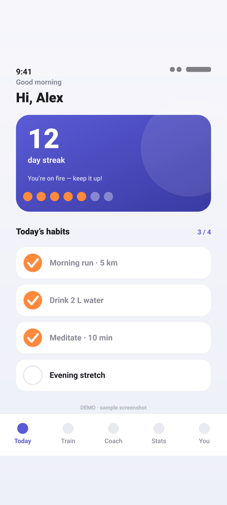
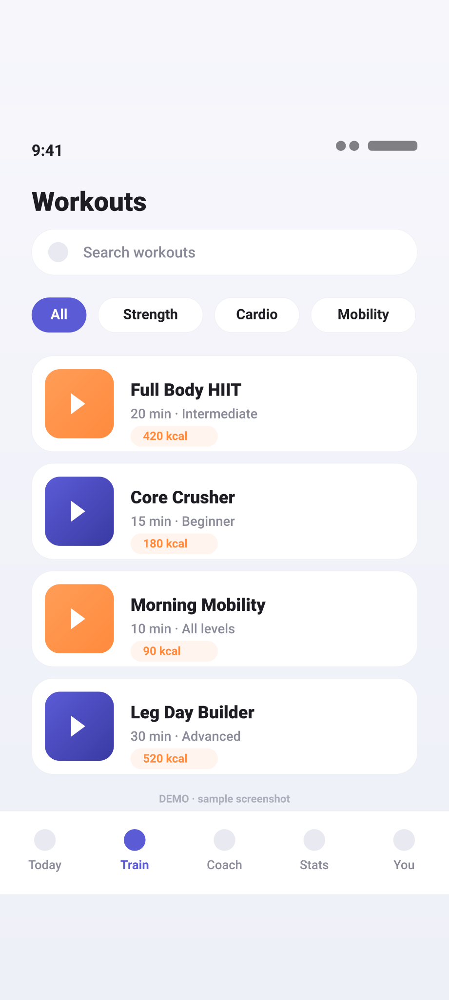
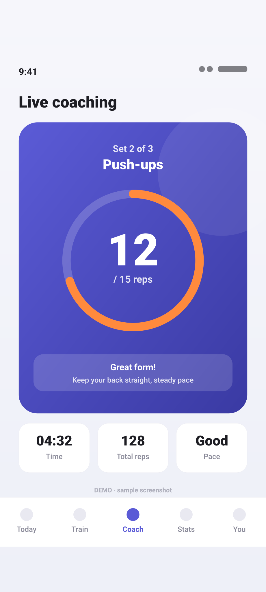
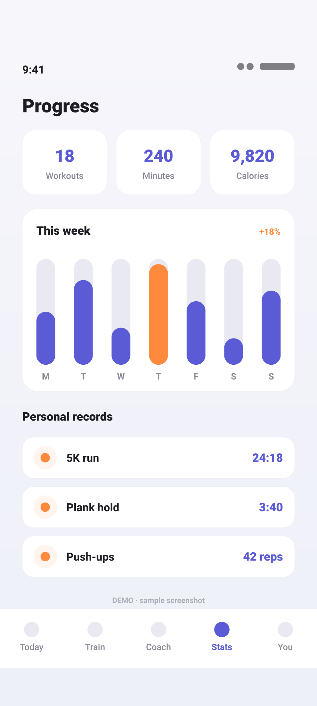
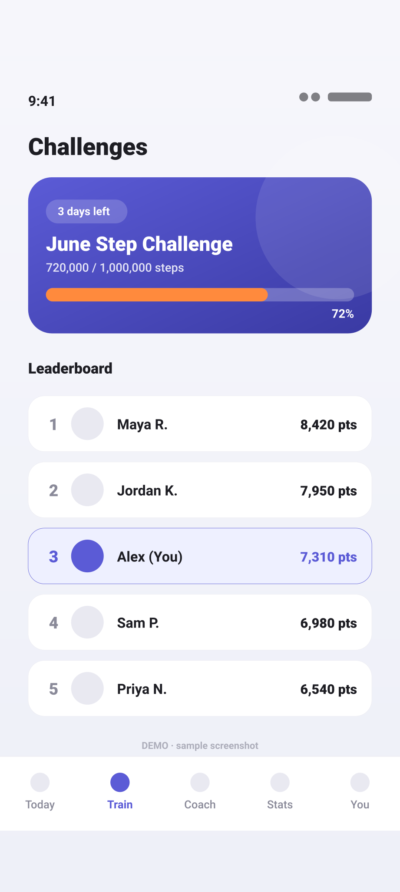
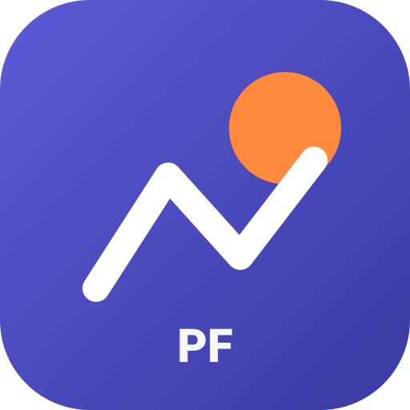
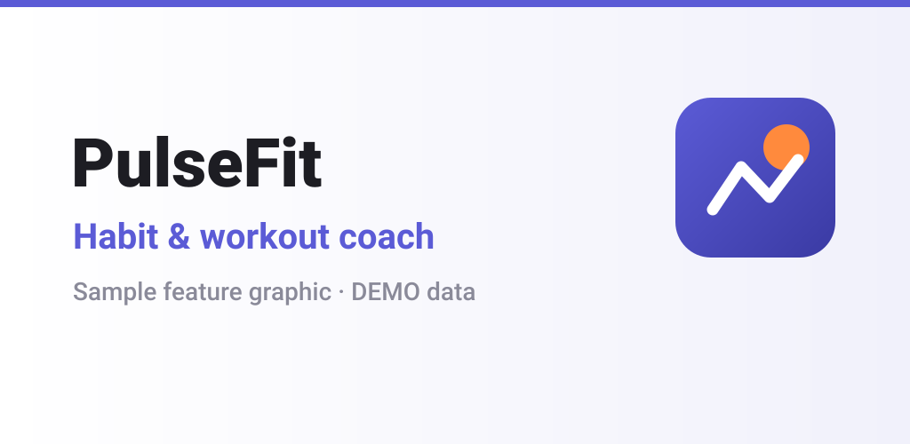

# Store Listing Preview Tool

A single-file, JSON-driven mockup of how an app looks on the **Apple App Store**
and **Google Play** store pages — review listing copy, screenshots and graphics
before you submit. Ships with **dummy demo data** ("PulseFit") so it runs as-is.

> **🔗 Live demo:** **https://fighttechvn.github.io/app_marketing/**
> (deployed from [fighttechvn/app_marketing](https://github.com/fighttechvn/app_marketing) via GitHub Pages)

## Demo screenshots

Bundled dummy "PulseFit" sample screens (generated by `gen-dummy.mjs` — all fake demo data):

<table>
  <tr>
    <td align="center"><br><sub><b>Today</b><br>streak + habits</sub></td>
    <td align="center"><br><sub><b>Workouts</b><br>browse + filter</sub></td>
    <td align="center"><br><sub><b>Live coaching</b><br>rep counter</sub></td>
    <td align="center"><br><sub><b>Progress</b><br>weekly stats</sub></td>
    <td align="center"><br><sub><b>Challenges</b><br>leaderboard</sub></td>
  </tr>
</table>

App icon &amp; Play feature graphic:

<table>
  <tr>
    <td align="center"><br><sub><b>App icon</b><br>512×512</sub></td>
    <td align="center"><br><sub><b>Feature graphic</b><br>1024×500</sub></td>
  </tr>
</table>

## What you need to run

| Input | Required? | Notes |
|-------|-----------|-------|
| A static web server | ✅ | `python3` (3.x) **or** `node` — only to serve files over http. |
| `index.html` | ✅ | The single-file app. |
| `listing.json` | ✅ | Listing data the page loads on startup (bundled dummy "PulseFit"). |
| `assets/*.svg` | ✅ | Icon, feature graphic and screenshots referenced by `listing.json`. |
| `node` (≥ 18) | optional | Only to **regenerate** the dummy screenshots with `gen-dummy.mjs`. |
| Env vars / secrets | ❌ none | This tool is fully client-side — no API keys, `.env`, or network access. |

> The store credentials in `../assets/.env.example` are for the **fastlane**
> upload half of this skill, **not** for this preview tool.

## Run

```bash
cd store-preview
python3 -m http.server 8092      # or: npx serve -l 8092 .
# open http://localhost:8092/
```
(Browsers block `fetch()` over `file://`, so serve it over http.)

### Regenerate the dummy screenshots

The bundled screenshots/icon/feature graphic in `assets/` are generated — edit
the content or layout in `gen-dummy.mjs`, then:

```bash
node gen-dummy.mjs   # rewrites assets/{phone,iphone,tablet,ipad}-NN.svg + icon + feature graphic
```

## Features

- **App Store / Google Play** layout toggle, locale switcher.
- **ASO checks** — live per-field character-limit counters per store.
- **✏️ Edit on page** — click any rendered text (name, subtitle, description,
  keywords, what's new, title, short description, developer, rating…) to edit it
  inline; edits write back to the data and ASO counters update live. Each
  screenshot gets replace/remove/add controls; app icon + feature graphic are
  click-to-replace.
- **🖼️ Drag & drop images** — drop image files or a whole folder anywhere (or
  *Load images…*); auto-sorted into iPhone / iPad / phone / tablet galleries,
  app icon and feature graphic by filename + aspect ratio.
- **Edit JSON** — edit the raw listing JSON and apply.
- **⬇️ Export data** — download the current `listing.json` (including inline edits).
- **✅ Release checklist** — built-in interactive first-submission checklist
  (mirrors `../references/submission-checklist.md`); progress saved in the browser.

## Use with your own app

1. Click **Load JSON…** and open your own `listing.json` (same shape as the
   bundled one), or edit the demo inline.
2. Drag your screenshots (or their folder) onto the page to fill the galleries.
3. Tweak copy with **Edit on page** / **Edit JSON**, watch **ASO checks**, then
   **Export data**.

## `listing.json` shape

```jsonc
{
  "app":   { "name", "androidPackage", "iosBundleId", "versionName", "icon", "developer", "rating", "downloads", "locales": [...], ... },
  "limits": { "appstore": {...}, "googleplay": {...} },     // ASO character limits
  "locales": { "en-US": { "displayName", "appstore": {...}, "googleplay": {...}, "fullDescription", "whatsNew" }, ... },
  "screenshots": { "iphone": [{file,label,size}], "ipad": [...], "phone": [...], "tablet": [...] },
  "graphics": { "appIcon": {status,file,spec}, "featureGraphic": {status,file,spec} }
}
```

## Deploy your own preview

The whole tool is static (`index.html` + `listing.json` + `assets/`), so any
static host works. Live demo is published to GitHub Pages from
[fighttechvn/app_marketing](https://github.com/fighttechvn/app_marketing):

```bash
# from this folder — push the static site to the app_marketing repo
git init -b main && git add index.html listing.json assets gen-dummy.mjs README.md
git commit -m "Deploy store-listing preview"
git remote add origin https://github.com/fighttechvn/app_marketing.git
git push -u origin main
# then enable Pages (main / root):
gh api -X POST repos/fighttechvn/app_marketing/pages -f 'source[branch]=main' -f 'source[path]=/'
```

→ served at **https://fighttechvn.github.io/app_marketing/**

> Older reference deployment: https://fighttechvn.github.io/mobilestore/
